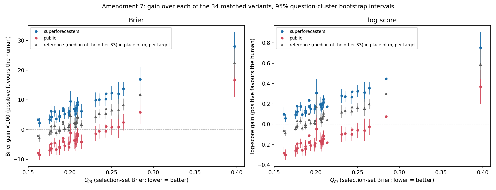

# SPEC v3 Amendment 7: per-variant per-forecaster gain

Spec: amendment `f4044ee4cf418bfd0d9cc2eabe2c2f1955c33a1a`, clarification `1db593d6209cd688e0cfc352f74821f6d6636093` (specs/forecast_spec_v3.md, both committed before this code was written or run); Note 2 `820e868aa60df58fe95c6ad86bc0be9167f94e91` (after results, descriptive addition). Repo HEAD at run: `820e868aa60df58fe95c6ad86bc0be9167f94e91`. No v1, v2 or P5 number changes.

## Reproduction check (first)

As clarified: G_B against M1 reproduces v1 H1 in the point estimate (to four decimals) and in v1 H1's own analytic question-clustered interval (`models.group_means_cluster`) recomputed on the Amendment 7 rows. The Amendment 7 per-row G_B and G_L for M1 are also bit-identical to the frame's `G_a` ×100 and `G_log`: yes.

| group | Amendment 7, analytic | v1 H1 (locked) | match |
|---|---|---|---|
| S | +3.3826 [1.36, 5.41] | +3.3826 [1.36, 5.41] | yes |
| P | -7.8091 [-9.69, -5.92] | -7.8091 [-9.69, -5.92] | yes |

Reference object check: the v2 Amendment 2 reference cross-fitted log-score gain, rebuilt here, gives the stage-2 slope 1.2076 [0.8766, 1.5386], equal to the Amendment 2 report.

## Setup

- Frame: `data/derived/full_frame.pkl`, the v1 H1 frame (33,334 forecaster-target rows, 578 targets, 162 questions; v1 Amendment 2 row exclusions applied). For each variant m the frame is reused with m's forecast in place of baseline (a); rows where m's forecast is imputed or missing are dropped for that variant only.
- G_B(m) = Brier(m) − Brier(human) per row, ×100. G_L(m) = log score(human) − log score(m) per row, probabilities clipped to [0.01, 0.99]. Both exactly as `fbdata.build_frame` defines G_a and G_log.
- Intervals: question-level cluster bootstrap, 2000 draws, seed 20260906, percentile 95%. One set of question draws serves every variant, group and quantity, items 1 and 2 alike.
- Reference (item 2): leave-one-out median of the other 33 variants on each target (v2 Amendment 2; at least 10 contributing variants), on targets where m has a non-imputed forecast. Log score: the cross-fitted out-of-sample gain from adding the reference to a logistic recalibration of m (`v2full.crossfit_gain`, 5 folds by question, fold seed 20260908); within each bootstrap draw the folds are reassigned on the draw's clusters, as in Amendment 2. Brier: mean over targets of Brier(m) − Brier(reference), ×100, no fitting (the spec does not name a cross-fitted Brier; this reading is chosen here and flagged). Failed draws: 0.
- Note 2 (`820e868aa60df58fe95c6ad86bc0be9167f94e91`, after results, descriptive, no estimate changes): the cross-fitted log-score gain above is a combination gain (reference added to m), while G_L is a substitution gain (human in place of m). The reference's substitution gain, log score(reference) − log score(m) per target under the same clip, is added as the last column of the item 2 table with the same bootstrap, and is what the log panel of the figure plots beside the human G_L. The Brier panel already compares substitution with substitution.
- Variants are ordered by selection-set Q (v1 §4 Brier on the 930-target selection set).

## Locked reading (restated)

- 34 variants are not 34 independent tests. The paper reports the curve and the counts, with the variants ordered by selection-set Q. No per-variant p-values enter the paper.
- Recorded expectation from the v2 point estimates: superforecasters positive against all 34 under Brier; public positive against about 6 and negative against about 28. The counts below show whether the sign flip for the public group survives the intervals; the paper reports them whatever they are.
- Scoring-rule check for Section 5: if no variant moves between rules, Section 5 gets one sentence; if any does, the variant is named.

## Counts (item 3): variants of 34 by where the 95% interval lies

| group | rule | above zero | below zero | includes zero |
|---|---|---|---|---|
| S | G_B | 34 | 0 | 0 |
| S | G_L | 34 | 0 | 0 |
| P | G_B | 2 | 21 | 11 |
| P | G_L | 1 | 26 | 7 |

## Scoring-rule check

10 variant-group pairs move between rules (sign of the point estimate differs, or the interval excludes zero under one rule and not the other):

| variant | group | Q | G_B | G_L | sign_differs | exclusion_differs |
|---|---|---|---|---|---|---|
| Gemini-1.5-Flash (scratchpad with freeze values) | P | 0.2091 | -2.06 [-4.50, +0.62] | -0.141 [-0.208, -0.071] | no | yes |
| Claude-2.1 (zero shot with freeze values) | P | 0.2093 | -1.42 [-3.36, +0.30] | -0.115 [-0.176, -0.061] | no | yes |
| Mixtral-8x7B-Instruct-V0.1 (scratchpad with freeze values) | P | 0.2310 | -1.34 [-3.89, +1.35] | -0.099 [-0.174, -0.020] | no | yes |
| Llama-3-8b-Chat-Hf (scratchpad with freeze values) | P | 0.2353 | -0.54 [-3.00, +1.85] | -0.092 [-0.162, -0.024] | no | yes |
| Claude-2.1 (scratchpad with freeze values) | P | 0.2431 | -0.51 [-2.69, +1.78] | -0.099 [-0.166, -0.031] | no | yes |
| Claude-3-Haiku-20240307 (scratchpad with freeze values) | P | 0.2435 | +1.14 [-1.84, +4.10] | -0.053 [-0.134, +0.026] | yes | no |
| Llama-2-70b-Chat-Hf (scratchpad with freeze values) | P | 0.2501 | +0.82 [-1.89, +3.56] | -0.058 [-0.133, +0.016] | yes | no |
| Llama-2-70b-Chat-Hf (zero shot with freeze values) | P | 0.2582 | +0.91 [-2.95, +5.13] | -0.061 [-0.164, +0.055] | yes | no |
| GPT-3.5-Turbo-0125 (scratchpad with freeze values) | P | 0.2642 | +2.48 [-0.27, +5.18] | -0.025 [-0.103, +0.049] | yes | no |
| Claude-3-Haiku-20240307 (zero shot with freeze values) | P | 0.2841 | +5.86 [+1.90, +10.06] | +0.075 [-0.045, +0.204] | no | yes |

## Superforecasters: gain over each variant (item 1)

| variant | scaffold | Q | n rows | G_B ×100 [95% CI] | G_L [95% CI] |
|---|---|---|---|---|---|
| Claude-3-5-Sonnet-20240620 ¹ | zero shot with freeze values | 0.1616 | 4,797 | +3.38 [+1.52, +5.62] | +0.098 [+0.044, +0.165] |
| Claude-3-5-Sonnet-20240620 | scratchpad with freeze values | 0.1634 | 4,797 | +2.23 [+0.74, +3.82] | +0.058 [+0.019, +0.098] |
| GPT-4-Turbo-2024-04-09 | zero shot with freeze values | 0.1756 | 4,797 | +3.38 [+1.84, +5.10] | +0.093 [+0.053, +0.134] |
| Claude-3-Opus-20240229 | scratchpad with freeze values | 0.1773 | 4,797 | +4.27 [+2.38, +6.33] | +0.118 [+0.070, +0.168] |
| GPT-4-Turbo-2024-04-09 | scratchpad with freeze values | 0.1776 | 4,797 | +6.19 [+4.05, +8.38] | +0.178 [+0.121, +0.239] |
| Gemini-1.5-Pro | scratchpad with freeze values | 0.1779 | 4,797 | +4.34 [+2.67, +6.09] | +0.125 [+0.080, +0.170] |
| Qwen1.5-110B-Chat | scratchpad with freeze values | 0.1818 | 4,797 | +6.12 [+4.40, +7.97] | +0.175 [+0.128, +0.221] |
| Claude-3-Opus-20240229 | zero shot with freeze values | 0.1836 | 4,797 | +3.68 [+2.09, +5.48] | +0.097 [+0.055, +0.145] |
| GPT-4o | scratchpad with freeze values | 0.1875 | 4,797 | +4.37 [+2.61, +6.26] | +0.113 [+0.069, +0.160] |
| GPT-4-0613 | zero shot with freeze values | 0.1877 | 4,797 | +4.57 [+2.65, +6.54] | +0.132 [+0.082, +0.181] |
| Llama-3-8b-Chat-Hf | zero shot with freeze values | 0.1918 | 4,797 | +7.14 [+4.35, +10.42] | +0.234 [+0.116, +0.383] |
| Qwen1.5-110B-Chat | zero shot with freeze values | 0.1920 | 4,797 | +6.41 [+4.71, +8.10] | +0.175 [+0.132, +0.216] |
| GPT-4-0613 | scratchpad with freeze values | 0.1937 | 4,775 | +5.27 [+3.57, +6.91] | +0.153 [+0.105, +0.197] |
| Gemini-1.5-Pro | zero shot with freeze values | 0.1986 | 4,797 | +5.67 [+3.73, +7.68] | +0.150 [+0.101, +0.199] |
| Mistral-Large-Latest | scratchpad with freeze values | 0.1989 | 4,797 | +4.93 [+3.27, +6.61] | +0.151 [+0.104, +0.193] |
| Mixtral-8x22B-Instruct-V0.1 | scratchpad with freeze values | 0.1991 | 4,797 | +6.20 [+4.33, +8.08] | +0.174 [+0.126, +0.220] |
| Mixtral-8x7B-Instruct-V0.1 | zero shot with freeze values | 0.2006 | 4,797 | +9.55 [+6.33, +13.07] | +0.309 [+0.189, +0.447] |
| Mixtral-8x22B-Instruct-V0.1 | zero shot with freeze values | 0.2053 | 4,797 | +6.95 [+4.50, +9.63] | +0.196 [+0.129, +0.267] |
| GPT-4o | zero shot with freeze values | 0.2064 | 4,797 | +6.42 [+4.37, +8.42] | +0.169 [+0.117, +0.218] |
| Mistral-Large-Latest | zero shot with freeze values | 0.2072 | 4,797 | +5.30 [+3.07, +7.71] | +0.150 [+0.095, +0.211] |
| Llama-3-70b-Chat-Hf | zero shot with freeze values | 0.2075 | 4,797 | +7.22 [+5.03, +9.47] | +0.188 [+0.134, +0.240] |
| Llama-3-70b-Chat-Hf | scratchpad with freeze values | 0.2077 | 4,797 | +7.14 [+5.10, +9.33] | +0.202 [+0.148, +0.254] |
| Gemini-1.5-Flash | scratchpad with freeze values | 0.2091 | 4,797 | +8.36 [+5.98, +10.83] | +0.215 [+0.155, +0.276] |
| Claude-2.1 | zero shot with freeze values | 0.2093 | 4,775 | +9.20 [+7.28, +10.86] | +0.245 [+0.191, +0.291] |
| Gemini-1.5-Flash | zero shot with freeze values | 0.2136 | 4,797 | +6.24 [+3.97, +8.67] | +0.172 [+0.111, +0.238] |
| Mixtral-8x7B-Instruct-V0.1 | scratchpad with freeze values | 0.2310 | 4,545 | +9.96 [+7.49, +12.55] | +0.279 [+0.210, +0.350] |
| Llama-3-8b-Chat-Hf | scratchpad with freeze values | 0.2353 | 4,797 | +10.09 [+7.99, +12.18] | +0.271 [+0.214, +0.327] |
| Claude-2.1 | scratchpad with freeze values | 0.2431 | 4,287 | +10.27 [+8.01, +12.52] | +0.267 [+0.204, +0.326] |
| Claude-3-Haiku-20240307 | scratchpad with freeze values | 0.2435 | 4,797 | +12.10 [+9.56, +14.75] | +0.320 [+0.254, +0.385] |
| Llama-2-70b-Chat-Hf | scratchpad with freeze values | 0.2501 | 4,797 | +12.32 [+10.08, +14.62] | +0.326 [+0.267, +0.384] |
| Llama-2-70b-Chat-Hf | zero shot with freeze values | 0.2582 | 4,785 | +12.09 [+8.47, +16.03] | +0.312 [+0.222, +0.413] |
| GPT-3.5-Turbo-0125 | scratchpad with freeze values | 0.2642 | 4,797 | +13.81 [+11.43, +16.12] | +0.356 [+0.293, +0.414] |
| Claude-3-Haiku-20240307 | zero shot with freeze values | 0.2841 | 4,713 | +16.93 [+13.13, +21.13] | +0.446 [+0.341, +0.565] |
| GPT-3.5-Turbo-0125 | zero shot with freeze values | 0.3974 | 4,797 | +28.04 [+22.39, +32.85] | +0.754 [+0.589, +0.907] |

¹ M1 (benchmark (a)). Analytic question-clustered interval (v1 H1 method) for G_B: +3.38 [+1.36, +5.41]; the bootstrap interval is in the table.

## Public: gain over each variant (item 1)

| variant | scaffold | Q | n rows | G_B ×100 [95% CI] | G_L [95% CI] |
|---|---|---|---|---|---|
| Claude-3-5-Sonnet-20240620 ¹ | zero shot with freeze values | 0.1616 | 28,537 | -7.81 [-9.66, -5.82] | -0.283 [-0.339, -0.226] |
| Claude-3-5-Sonnet-20240620 | scratchpad with freeze values | 0.1634 | 28,537 | -8.43 [-10.25, -6.53] | -0.301 [-0.353, -0.249] |
| GPT-4-Turbo-2024-04-09 | zero shot with freeze values | 0.1756 | 28,537 | -6.94 [-8.96, -4.79] | -0.260 [-0.318, -0.201] |
| Claude-3-Opus-20240229 | scratchpad with freeze values | 0.1773 | 28,537 | -6.30 [-8.71, -3.75] | -0.242 [-0.305, -0.173] |
| GPT-4-Turbo-2024-04-09 | scratchpad with freeze values | 0.1776 | 28,537 | -4.68 [-6.95, -2.36] | -0.191 [-0.256, -0.125] |
| Gemini-1.5-Pro | scratchpad with freeze values | 0.1779 | 28,537 | -6.28 [-8.13, -4.35] | -0.235 [-0.290, -0.181] |
| Qwen1.5-110B-Chat | scratchpad with freeze values | 0.1818 | 28,537 | -4.43 [-5.95, -2.90] | -0.186 [-0.232, -0.141] |
| Claude-3-Opus-20240229 | zero shot with freeze values | 0.1836 | 28,537 | -6.66 [-8.57, -4.55] | -0.256 [-0.314, -0.194] |
| GPT-4o | scratchpad with freeze values | 0.1875 | 28,537 | -6.10 [-8.47, -3.60] | -0.242 [-0.309, -0.175] |
| GPT-4-0613 | zero shot with freeze values | 0.1877 | 28,537 | -5.71 [-7.95, -3.37] | -0.219 [-0.286, -0.153] |
| Llama-3-8b-Chat-Hf | zero shot with freeze values | 0.1918 | 28,537 | -2.95 [-5.44, +0.02] | -0.112 [-0.225, +0.029] |
| Qwen1.5-110B-Chat | zero shot with freeze values | 0.1920 | 28,537 | -3.89 [-5.70, -2.10] | -0.178 [-0.232, -0.125] |
| GPT-4-0613 | scratchpad with freeze values | 0.1937 | 28,484 | -5.40 [-7.13, -3.67] | -0.209 [-0.262, -0.159] |
| Gemini-1.5-Pro | zero shot with freeze values | 0.1986 | 28,537 | -4.75 [-7.10, -2.29] | -0.205 [-0.269, -0.139] |
| Mistral-Large-Latest | scratchpad with freeze values | 0.1989 | 28,537 | -5.90 [-7.67, -3.99] | -0.217 [-0.271, -0.163] |
| Mixtral-8x22B-Instruct-V0.1 | scratchpad with freeze values | 0.1991 | 28,537 | -4.37 [-6.59, -2.12] | -0.186 [-0.249, -0.124] |
| Mixtral-8x7B-Instruct-V0.1 | zero shot with freeze values | 0.2006 | 28,537 | -1.01 [-4.09, +2.33] | -0.045 [-0.162, +0.089] |
| Mixtral-8x22B-Instruct-V0.1 | zero shot with freeze values | 0.2053 | 28,537 | -3.61 [-6.41, -0.63] | -0.164 [-0.242, -0.083] |
| GPT-4o | zero shot with freeze values | 0.2064 | 28,537 | -3.67 [-6.06, -1.22] | -0.178 [-0.247, -0.111] |
| Mistral-Large-Latest | zero shot with freeze values | 0.2072 | 28,537 | -4.69 [-7.24, -1.99] | -0.196 [-0.267, -0.122] |
| Llama-3-70b-Chat-Hf | zero shot with freeze values | 0.2075 | 28,537 | -3.24 [-5.70, -0.70] | -0.169 [-0.237, -0.104] |
| Llama-3-70b-Chat-Hf | scratchpad with freeze values | 0.2077 | 28,537 | -3.44 [-5.92, -1.03] | -0.159 [-0.229, -0.095] |
| Gemini-1.5-Flash | scratchpad with freeze values | 0.2091 | 28,537 | -2.06 [-4.50, +0.62] | -0.141 [-0.208, -0.071] |
| Claude-2.1 | zero shot with freeze values | 0.2093 | 28,484 | -1.42 [-3.36, +0.30] | -0.115 [-0.176, -0.061] |
| Gemini-1.5-Flash | zero shot with freeze values | 0.2136 | 28,537 | -4.13 [-6.50, -1.60] | -0.182 [-0.253, -0.109] |
| Mixtral-8x7B-Instruct-V0.1 | scratchpad with freeze values | 0.2310 | 27,708 | -1.34 [-3.89, +1.35] | -0.099 [-0.174, -0.020] |
| Llama-3-8b-Chat-Hf | scratchpad with freeze values | 0.2353 | 28,537 | -0.54 [-3.00, +1.85] | -0.092 [-0.162, -0.024] |
| Claude-2.1 | scratchpad with freeze values | 0.2431 | 26,889 | -0.51 [-2.69, +1.78] | -0.099 [-0.166, -0.031] |
| Claude-3-Haiku-20240307 | scratchpad with freeze values | 0.2435 | 28,537 | +1.14 [-1.84, +4.10] | -0.053 [-0.134, +0.026] |
| Llama-2-70b-Chat-Hf | scratchpad with freeze values | 0.2501 | 28,537 | +0.82 [-1.89, +3.56] | -0.058 [-0.133, +0.016] |
| Llama-2-70b-Chat-Hf | zero shot with freeze values | 0.2582 | 28,487 | +0.91 [-2.95, +5.13] | -0.061 [-0.164, +0.055] |
| GPT-3.5-Turbo-0125 | scratchpad with freeze values | 0.2642 | 28,537 | +2.48 [-0.27, +5.18] | -0.025 [-0.103, +0.049] |
| Claude-3-Haiku-20240307 | zero shot with freeze values | 0.2841 | 28,158 | +5.86 [+1.90, +10.06] | +0.075 [-0.045, +0.204] |
| GPT-3.5-Turbo-0125 | zero shot with freeze values | 0.3974 | 28,537 | +16.65 [+11.01, +21.83] | +0.369 [+0.198, +0.536] |

¹ M1 (benchmark (a)). Analytic question-clustered interval (v1 H1 method) for G_B: -7.81 [-9.69, -5.92]; the bootstrap interval is in the table.

## Reference curve's own gain over each variant (item 2)

Reference minus m: positive means the median of the other 33 variants beats m.

| variant | scaffold | Q | n targets | Brier gain ×100 [95% CI] | cross-fitted log-score gain [95% CI] | substitution log-score gain [95% CI] (Note 2) |
|---|---|---|---|---|---|---|
| Claude-3-5-Sonnet-20240620 | zero shot with freeze values | 0.1616 | 578 | -2.02 [-3.18, -0.81] | +0.0071 [-0.0041, +0.0313] | -0.063 [-0.094, -0.032] |
| Claude-3-5-Sonnet-20240620 | scratchpad with freeze values | 0.1634 | 578 | -2.80 [-4.02, -1.63] | +0.0029 [-0.0058, +0.0171] | -0.085 [-0.114, -0.057] |
| GPT-4-Turbo-2024-04-09 | zero shot with freeze values | 0.1756 | 578 | -1.18 [-2.02, -0.26] | +0.0163 [-0.0017, +0.0387] | -0.041 [-0.061, -0.019] |
| Claude-3-Opus-20240229 | scratchpad with freeze values | 0.1773 | 578 | -0.50 [-1.87, +0.91] | +0.0265 [+0.0043, +0.0529] | -0.022 [-0.052, +0.011] |
| GPT-4-Turbo-2024-04-09 | scratchpad with freeze values | 0.1776 | 578 | +1.15 [-0.16, +2.57] | +0.0565 [+0.0189, +0.0991] | +0.030 [-0.002, +0.066] |
| Gemini-1.5-Pro | scratchpad with freeze values | 0.1779 | 578 | -0.53 [-1.84, +0.79] | +0.0439 [+0.0152, +0.0776] | -0.016 [-0.046, +0.014] |
| Qwen1.5-110B-Chat | scratchpad with freeze values | 0.1818 | 578 | +1.33 [-0.08, +2.85] | +0.0896 [+0.0449, +0.1387] | +0.035 [+0.004, +0.068] |
| Claude-3-Opus-20240229 | zero shot with freeze values | 0.1836 | 578 | -0.95 [-2.11, +0.36] | +0.0364 [+0.0037, +0.0670] | -0.038 [-0.067, -0.004] |
| GPT-4o | scratchpad with freeze values | 0.1875 | 578 | -0.32 [-1.55, +0.90] | +0.0121 [-0.0002, +0.0335] | -0.022 [-0.051, +0.007] |
| GPT-4-0613 | zero shot with freeze values | 0.1877 | 578 | -0.01 [-1.27, +1.23] | +0.0372 [+0.0117, +0.0750] | -0.001 [-0.033, +0.031] |
| Llama-3-8b-Chat-Hf | zero shot with freeze values | 0.1918 | 578 | +2.69 [-0.26, +6.16] | +0.1449 [+0.0617, +0.2088] | +0.101 [-0.017, +0.254] |
| Qwen1.5-110B-Chat | zero shot with freeze values | 0.1920 | 578 | +1.99 [+0.84, +3.15] | +0.0992 [+0.0570, +0.1412] | +0.044 [+0.019, +0.071] |
| GPT-4-0613 | scratchpad with freeze values | 0.1937 | 577 | +0.39 [-0.68, +1.51] | +0.0446 [+0.0154, +0.0821] | +0.012 [-0.013, +0.038] |
| Gemini-1.5-Pro | zero shot with freeze values | 0.1986 | 578 | +1.13 [+0.10, +2.30] | +0.0502 [+0.0206, +0.0840] | +0.017 [-0.009, +0.044] |
| Mistral-Large-Latest | scratchpad with freeze values | 0.1989 | 578 | -0.15 [-1.16, +0.97] | +0.0275 [+0.0093, +0.0568] | +0.003 [-0.021, +0.029] |
| Mixtral-8x22B-Instruct-V0.1 | scratchpad with freeze values | 0.1991 | 578 | +1.49 [+0.21, +2.78] | +0.0627 [+0.0298, +0.0989] | +0.036 [+0.007, +0.066] |
| Mixtral-8x7B-Instruct-V0.1 | zero shot with freeze values | 0.2006 | 578 | +4.79 [+1.79, +8.08] | +0.1188 [+0.0706, +0.2073] | +0.172 [+0.060, +0.303] |
| Mixtral-8x22B-Instruct-V0.1 | zero shot with freeze values | 0.2053 | 578 | +2.26 [+0.55, +4.05] | +0.0936 [+0.0486, +0.1409] | +0.058 [+0.013, +0.105] |
| GPT-4o | zero shot with freeze values | 0.2064 | 578 | +2.14 [+0.20, +4.25] | +0.0708 [+0.0357, +0.1128] | +0.042 [-0.003, +0.091] |
| Mistral-Large-Latest | zero shot with freeze values | 0.2072 | 578 | +1.11 [-0.75, +3.04] | +0.0733 [+0.0379, +0.1246] | +0.024 [-0.023, +0.073] |
| Llama-3-70b-Chat-Hf | zero shot with freeze values | 0.2075 | 578 | +2.69 [+1.58, +3.80] | +0.0625 [+0.0357, +0.0992] | +0.053 [+0.028, +0.078] |
| Llama-3-70b-Chat-Hf | scratchpad with freeze values | 0.2077 | 578 | +2.43 [+1.29, +3.55] | +0.0344 [+0.0150, +0.0678] | +0.064 [+0.038, +0.088] |
| Gemini-1.5-Flash | scratchpad with freeze values | 0.2091 | 578 | +3.92 [+2.14, +5.78] | +0.1172 [+0.0694, +0.1657] | +0.083 [+0.041, +0.125] |
| Claude-2.1 | zero shot with freeze values | 0.2093 | 577 | +4.45 [+2.91, +5.88] | +0.1206 [+0.0782, +0.1733] | +0.107 [+0.071, +0.140] |
| Gemini-1.5-Flash | zero shot with freeze values | 0.2136 | 578 | +1.77 [+0.51, +3.14] | +0.0689 [+0.0360, +0.1179] | +0.041 [+0.002, +0.083] |
| Mixtral-8x7B-Instruct-V0.1 | scratchpad with freeze values | 0.2310 | 561 | +4.31 [+2.15, +6.69] | +0.1369 [+0.0894, +0.1927] | +0.119 [+0.061, +0.187] |
| Llama-3-8b-Chat-Hf | scratchpad with freeze values | 0.2353 | 578 | +5.43 [+3.84, +7.07] | +0.1175 [+0.0783, +0.1660] | +0.133 [+0.096, +0.170] |
| Claude-2.1 | scratchpad with freeze values | 0.2431 | 545 | +5.47 [+3.69, +7.27] | +0.1635 [+0.1118, +0.2261] | +0.127 [+0.085, +0.168] |
| Claude-3-Haiku-20240307 | scratchpad with freeze values | 0.2435 | 578 | +6.97 [+5.14, +8.86] | +0.1350 [+0.0833, +0.1845] | +0.169 [+0.127, +0.212] |
| Llama-2-70b-Chat-Hf | scratchpad with freeze values | 0.2501 | 578 | +6.58 [+4.75, +8.64] | +0.1111 [+0.0748, +0.1621] | +0.162 [+0.119, +0.209] |
| Llama-2-70b-Chat-Hf | zero shot with freeze values | 0.2582 | 577 | +6.59 [+3.62, +10.17] | +0.1153 [+0.0691, +0.1683] | +0.156 [+0.083, +0.244] |
| GPT-3.5-Turbo-0125 | scratchpad with freeze values | 0.2642 | 578 | +8.36 [+6.44, +10.51] | +0.1374 [+0.0944, +0.1888] | +0.198 [+0.154, +0.248] |
| Claude-3-Haiku-20240307 | zero shot with freeze values | 0.2841 | 570 | +11.86 [+8.20, +15.90] | +0.1881 [+0.1357, +0.2444] | +0.299 [+0.199, +0.413] |
| GPT-3.5-Turbo-0125 | zero shot with freeze values | 0.3974 | 578 | +22.50 [+17.53, +27.16] | +0.2016 [+0.1460, +0.2600] | +0.590 [+0.442, +0.736] |

All numbers: `docs/amendment7_pervariant.csv`. Rows dropped for imputed forecasts, per variant: GPT-4-0613 (scratchpad with freeze values) 75, Claude-2.1 (zero shot with freeze values) 75, Mixtral-8x7B-Instruct-V0.1 (scratchpad with freeze values) 1081, Claude-2.1 (scratchpad with freeze values) 2158, Llama-2-70b-Chat-Hf (zero shot with freeze values) 62, Claude-3-Haiku-20240307 (zero shot with freeze values) 463.

Runtime 552s.
