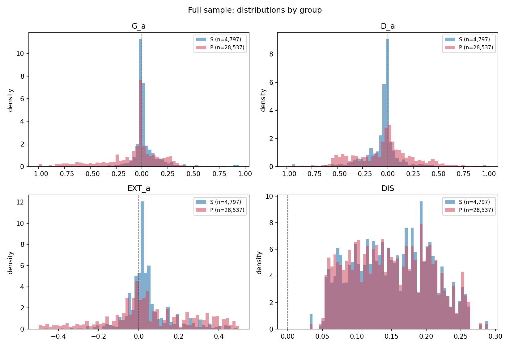
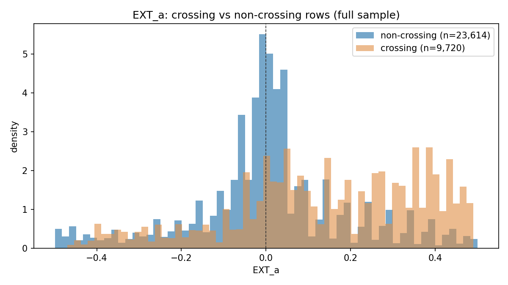
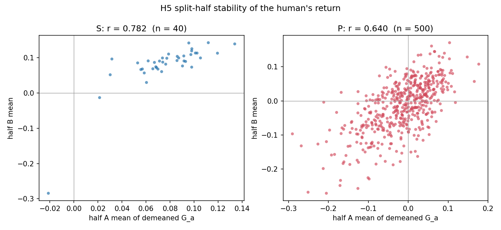
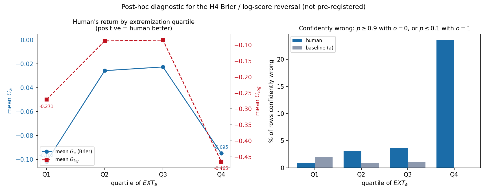

# ForecastBench full run — SPEC v1 + Amendments 1 and 2

Generated 2026-09-07 00:55:54Z · spec commit `e976bf5` · **full sample**

All resolved human targets. H1–H5, the three SPEC §7 robustness items, and the two Amendment 2 sensitivities. SPEC §9 items 1–12 follow. The pilot (`forecast_pilot_REPORT.md`) was accepted on 2026-09-06; nothing in the pipeline changed except the additions Amendment 2 requires.

## Core quantities at a glance

Estimates with 95% CIs. Interpretation is confined to §12.

| Hypothesis | Quantity | Estimate [95% CI] |
|---|---|---|
| H1 | mean `G_a` ×100, superforecasters | 3.38 [1.36, 5.41] |
| H1 | mean `G_a` ×100, public | -7.81 [-9.69, -5.92] |
| H2 | encompassing coef, superforecaster median | 1.7892 [1.0444, 2.5341] |
| H2 | encompassing coef, public median | 0.9718 [0.2397, 1.7040] |
| H3 | `DIS_z` on `G_a` (core) | 0.0009 [-0.0232, 0.0249] |
| H4 | `EXT_a_z` on `G_a` (core, sign only) | 0.0283 [0.0252, 0.0313] |
| H4 | `EXT_a_z:DIS_z` (the one locked interaction) | -0.0211 [-0.0245, -0.0177] |
| H4 | `EXT_a_z`, non-crossing rows (Amd 2 item 2) | 0.0218 [0.0199, 0.0236] |
| H5 | split-half r, superforecasters | 0.7818 [0.6147, 0.8991] |
| H5 | split-half r, public | 0.6400 [0.5900, 0.6874] |

Sign tests: all pass. Frame 33,334 rows · 578 targets · 162 questions · 540 forecasters · baseline (a) `Claude-3-5-Sonnet-20240620 (zero shot with freeze values)`.

All mixed models converged; no SPEC §5 / Amendment 1 D.1 fallback was used.

---

## 1. Environment and versions (§9 item 1)

| index | value |
|---|---|
| python | 3.9.6 |
| platform | Darwin 25.6.0 (arm64) |
| numpy | 2.0.2 |
| pandas | 2.3.3 |
| scipy | 1.13.1 |
| statsmodels | 0.14.6 |
| matplotlib | 3.9.4 |
| R / lme4 | not installed — mixed models fitted in statsmodels |

**Data provenance** (`data/PROVENANCE.md`; no re-download — SPEC 2.1):

| index | value |
|---|---|
| datasets repo commit | 68932db171f5e13349d9bda0dd9f96fcf6e227e2 |
| forecast_sets.tar.gz SHA-256 | 219998293a577c820dfa4fdc34541833bd99fd47b60854c2e0424c1a38490b45 |
| processed_forecast_sets.tar.gz SHA-256 | 7f20d24b16b5cacc0c9f1b4f09245aedb17f789504810402ba2458c6ca3486c7 |
| round | 2024-07-21 |
| split-half seed (H5) | 20260906 |
| bootstrap draws (H5) | 2000 |

**Amendment 2 item 1 — human forecasts outside [0, 1].** **200 rows excluded** from every analysis, from **42 distinct forecasters**, all in group **P** (public). Values run to 500,043,205.68. Clipping to [0, 1] appears in §11 as a sensitivity only and carries no conclusion.

---

## 2. Data coverage (§9 item 2)

| index | forecasters | rows | targets | questions | cov_min | cov_q1 | cov_med | cov_q3 | cov_max |
|---|---|---|---|---|---|---|---|---|---|
| P | 500.0 | 28537.0 | 578.0 | 162.0 | 22.0 | 51.0 | 58.0 | 64.0 | 84.0 |
| S | 40.0 | 4797.0 | 578.0 | 162.0 | 4.0 | 65.5 | 87.0 | 140.8 | 578.0 |

Total analysis frame: **33,334 forecaster × target rows**, 578 resolved targets, 162 questions, 540 forecasters.

Targets by family: **521 dataset, 57 market** (105 and 57 questions). This matches the SPEC 2.2 expectation of 578 targets across 162 questions (521 dataset, 57 market) exactly.

Forecasters per target — S: min 3, median 7, max 29; P: min 40, median 49, max 63 (Amendment 1 F.4).

**Model coverage.** Matched condition (Amendment 1 B.3) = freeze values, no supplied news: **34 variants** = 17 base models × 2 scaffolds. Human targets lacking a baseline-(a) forecast: **0**. Rows dropped because baseline (a) was imputed there (Amendment 1 A.3): **0**. Human market rows unmappable to a resolution date: **242**. Human rows dropped as unresolved: **21,596**.

Footnote (Amendment 1 F.3): the data contain 40 distinct superforecaster ids; the paper reports 39.

---

## 3. Baseline (a) (§9 item 3)

Selection set (Amendment 1 B.1, resolved single-question targets minus every human target): **930 targets** across 241 questions. **Intersection with the test set: 0** — empty, as SPEC §4 requires.

| model | brier | n_scored | imputed_share | eligible |
|---|---|---|---|---|
| Claude-3-5-Sonnet-20240620 (zero shot with freeze values) | 0.1616 | 930 | 0.0000 | yes |
| Claude-3-5-Sonnet-20240620 (scratchpad with freeze values) | 0.1634 | 930 | 0.0000 | yes |
| GPT-4-Turbo-2024-04-09 (zero shot with freeze values) | 0.1756 | 930 | 0.0000 | yes |
| Claude-3-Opus-20240229 (scratchpad with freeze values) | 0.1773 | 930 | 0.0000 | yes |
| GPT-4-Turbo-2024-04-09 (scratchpad with freeze values) | 0.1776 | 930 | 0.0000 | yes |

**Baseline (a) = `Claude-3-5-Sonnet-20240620 (zero shot with freeze values)`**, selection-set Brier 0.1616 (×100 = 16.16); runner-up `Claude-3-5-Sonnet-20240620 (scratchpad with freeze values)` at 0.1634 (×100 = 16.34). No tie. Identical to the pilot: the champion is chosen on the selection set, which the pilot sampling never touched.

Eligibility (Amendment 1 A.3): 1 of 34 ineligible: `Claude-2.1 (scratchpad with freeze values)` (5.1% imputed).

**Diagnostic — unrestricted-set champion (Amendment 1 B.1):** on the unrestricted set (6,680 targets, 86% combination questions) the winner is `Gemini-1.5-Pro (scratchpad with freeze values)` (Brier 0.1590), **not** the amended choice `Claude-3-5-Sonnet-20240620 (zero shot with freeze values)`. The restriction to single questions changes the baseline, which is what the amendment was written to prevent.

---

## 4. Sign tests (§9 item 4, SPEC §3)

- 20 rows (20 distinct targets) where the human is visibly closer → `G_a > 0`: **PASS**
- 20 rows where the model is visibly closer → `G_a < 0`: **PASS**
- 10 rows where the human is visibly more extreme → `EXT_a > 0`: **PASS**

**Human visibly closer:**

| row | forecaster | target | o | p_h | p_a | G_a |
|---|---|---|---|---|---|---|
| 1 | SFKcpXzkIR | manifold|PNVVTlruggno0Yw5tjVS|2024-08-05 | 1.0000 | 1.0000 | 0.0300 | 0.9409 |
| 2 | S3bbH6xnAb | polymarket|0xf5875410202b3545491774ab5e712a6e05a0ffe780c52270cc8d70cc95164411|2024-08-10 | 0.0000 | 0.0000 | 0.9500 | 0.9025 |
| 3 | PpNgCGWd3j | manifold|4puVWhIkvQiHnTxbH4NL|2024-09-13 | 0.0000 | 0.0000 | 0.9400 | 0.8836 |
| 4 | PSPpd7YIH0 | polymarket|0x573dfc705c8f4250064b3ad30d2cc43397f16c9fc5b343473c860bbd04d7a3ca|2024-12-01 | 1.0000 | 1.0000 | 0.0800 | 0.8464 |
| 5 | SON6ytut03 | wikipedia|4c98ccd0d64f8cad6896b50e8131b7173dcc95e40e1492413d69a7bf75d3328c|2024-08-20 | 0.0000 | 0.0000 | 0.9000 | 0.8100 |
| 6 | Pet51iBwUb | wikipedia|27e948952d66a749e55f37f9cb63036955768951570c627c3f16ec378df057f9|2024-10-19 | 0.0000 | 0.0000 | 0.8500 | 0.7225 |
| 7 | P2s1t6Uzpa | manifold|iokMHn6kkmntt9E0aHHz|2025-01-01 | 0.0000 | 0.0100 | 0.8500 | 0.7224 |
| 8 | PON6ytut03 | wikipedia|4c98ccd0d64f8cad6896b50e8131b7173dcc95e40e1492413d69a7bf75d3328c|2024-10-19 | 0.0000 | 0.0400 | 0.8500 | 0.7209 |
| 9 | Pet51iBwUb | wikipedia|27e948952d66a749e55f37f9cb63036955768951570c627c3f16ec378df057f9|2025-01-17 | 0.0000 | 0.0000 | 0.8000 | 0.6400 |
| 10 | PuChvzbkq1 | infer|1373|2025-01-01 | 0.0000 | 0.0000 | 0.7600 | 0.5776 |
| 11 | SbZAVaBSo6 | polymarket|0x122678509891ed9fe0b9ad7ff7a71a1a36aad334d9eae2d5421648b511371df1|2024-12-31 | 1.0000 | 1.0000 | 0.2400 | 0.5776 |
| 12 | PxOTMBYBZd | wikipedia|27e948952d66a749e55f37f9cb63036955768951570c627c3f16ec378df057f9|2025-07-21 | 0.0000 | 0.0000 | 0.7500 | 0.5625 |
| 13 | PExkoYCJnS | wikipedia|4c98ccd0d64f8cad6896b50e8131b7173dcc95e40e1492413d69a7bf75d3328c|2025-01-17 | 0.0000 | 0.0500 | 0.8000 | 0.6375 |
| 14 | PnAHpqGDzg | wikipedia|d61d058797047fb9793684b123dcf88a66f843695d9e65e9bc6df0f49ec9d936|2025-07-21 | 0.0000 | 0.0000 | 0.7500 | 0.5625 |
| 15 | SHMLCbokK1 | polymarket|0xc8081f7c63082b34b1b2497f339c291e00587e8800b48db8096fbe763c2be31c|2024-12-31 | 0.0000 | 0.0000 | 0.7200 | 0.5184 |
| 16 | PqSCtDbxAl | fred|IUDSOIA|2025-01-17 | 0.0000 | 0.0000 | 0.7000 | 0.4900 |
| 17 | PnAHpqGDzg | wikipedia|d61d058797047fb9793684b123dcf88a66f843695d9e65e9bc6df0f49ec9d936|2025-01-17 | 0.0000 | 0.0000 | 0.7000 | 0.4900 |
| 18 | PqSCtDbxAl | fred|IUDSOIA|2024-10-19 | 0.0000 | 0.0000 | 0.6500 | 0.4225 |
| 19 | PqSCtDbxAl | fred|IUDSOIA|2025-07-21 | 0.0000 | 0.0000 | 0.6500 | 0.4225 |
| 20 | PMLZmrHqKp | polymarket|0x154efa11ed56deca4d0d06adf2bb711a420f5128f2a274be0d6631ed4380ca78|2024-12-30 | 1.0000 | 1.0000 | 0.3500 | 0.4225 |

**Model visibly closer:**

| row | forecaster | target | o | p_h | p_a | G_a |
|---|---|---|---|---|---|---|
| 1 | PYDPZII5cb | acled|45db5d06a001a6fa62eb9b23236adab43c56970d70a833ca206fa42a57f4b7e6|2024-07-28 | 0.0000 | 1.0000 | 0.0100 | -0.9999 |
| 2 | PYDPZII5cb | acled|45db5d06a001a6fa62eb9b23236adab43c56970d70a833ca206fa42a57f4b7e6|2024-08-20 | 0.0000 | 1.0000 | 0.0100 | -0.9999 |
| 3 | PYDPZII5cb | acled|45db5d06a001a6fa62eb9b23236adab43c56970d70a833ca206fa42a57f4b7e6|2024-10-19 | 0.0000 | 1.0000 | 0.0100 | -0.9999 |
| 4 | PYDPZII5cb | acled|45db5d06a001a6fa62eb9b23236adab43c56970d70a833ca206fa42a57f4b7e6|2025-01-17 | 0.0000 | 1.0000 | 0.0100 | -0.9999 |
| 5 | PYDPZII5cb | acled|45db5d06a001a6fa62eb9b23236adab43c56970d70a833ca206fa42a57f4b7e6|2025-07-21 | 0.0000 | 1.0000 | 0.0100 | -0.9999 |
| 6 | PypNxV1S6s | acled|600e496f50daaa9743707de63ce115d974431d123cd136ff68b8f92bc74eb435|2025-01-17 | 0.0000 | 1.0000 | 0.0100 | -0.9999 |
| 7 | P0ljpFQFe6 | acled|600e496f50daaa9743707de63ce115d974431d123cd136ff68b8f92bc74eb435|2025-07-21 | 0.0000 | 1.0000 | 0.0100 | -0.9999 |
| 8 | PuR5ZXLYo4 | acled|9d683eff8747219752163f7d11d94ff96bbf3b3386a147b59c4829ddb5dac130|2025-01-17 | 0.0000 | 1.0000 | 0.0100 | -0.9999 |
| 9 | P2cY7Jk18R | acled|9d683eff8747219752163f7d11d94ff96bbf3b3386a147b59c4829ddb5dac130|2025-07-21 | 0.0000 | 1.0000 | 0.0100 | -0.9999 |
| 10 | PJidqWm1cu | infer|1413|2025-07-01 | 0.0000 | 1.0000 | 0.0100 | -0.9999 |
| 11 | P6CWceYfcO | metaculus|17432|2025-06-30 | 0.0000 | 1.0000 | 0.0100 | -0.9999 |
| 12 | PW0VYLvqR2 | polymarket|0xb3a14c854a91cc1d57bb4ed3ce1f74a1c3a08b9d6316f30874bda08e90fa663e|2024-09-04 | 0.0000 | 1.0000 | 0.0100 | -0.9999 |
| 13 | PM1xApZ24L | wikipedia|3c37fef353460bfd130fde0117638badaee913ee8c79b8cdf4c35e2c5710126a|2024-07-28 | 1.0000 | 0.0000 | 0.9900 | -0.9999 |
| 14 | PaGFOBQToE | wikipedia|61c0fb3703e68cee2439afd5c2d71522bc6649a1fa154491f58981456fa8ab68|2024-07-28 | 1.0000 | 0.0000 | 0.9900 | -0.9999 |
| 15 | P7aWY2TYGI | wikipedia|7c17d34e37d8cea481d3933f4e1c2c091bd523c3980043e539cde90fbc08f29a|2024-07-28 | 1.0000 | 0.0000 | 0.9900 | -0.9999 |
| 16 | PW0VYLvqR2 | wikipedia|cf373450466c71a49a7f2e82e176b66198255960bb1cf71d1721cd258d0c2b81|2024-07-28 | 0.0000 | 1.0000 | 0.0100 | -0.9999 |
| 17 | PW0VYLvqR2 | wikipedia|cf373450466c71a49a7f2e82e176b66198255960bb1cf71d1721cd258d0c2b81|2024-08-20 | 0.0000 | 1.0000 | 0.0100 | -0.9999 |
| 18 | P6CWceYfcO | wikipedia|e2ebe8c99e10583715b46ee35c93275a9a6b5721f812e6ce07f996daa8159732|2024-07-28 | 0.0000 | 1.0000 | 0.0100 | -0.9999 |
| 19 | PYBvARTBqj | acled|600e496f50daaa9743707de63ce115d974431d123cd136ff68b8f92bc74eb435|2024-10-19 | 0.0000 | 0.9900 | 0.0100 | -0.9800 |
| 20 | P9Zy9X0Oy4 | dbnomics|meteofrance_TEMPERATURE_celsius.07015.D|2025-01-17 | 0.0000 | 1.0000 | 0.0200 | -0.9996 |

**Human visibly more extreme:**

| row | forecaster | target | p_h | p_a | CONF_a | EXT_a |
|---|---|---|---|---|---|---|
| 1 | PMLZmrHqKp | dbnomics|meteofrance_TEMPERATURE_celsius.07015.D|2025-07-21 | 0.0000 | 0.5000 | 0.0000 | 0.5000 |
| 2 | P54fQcAB7K | dbnomics|meteofrance_TEMPERATURE_celsius.07020.D|2025-07-21 | 0.0000 | 0.5000 | 0.0000 | 0.5000 |
| 3 | PKEN0BFYaj | dbnomics|meteofrance_TEMPERATURE_celsius.07110.D|2025-07-21 | 0.0000 | 0.5000 | 0.0000 | 0.5000 |
| 4 | P2cY7Jk18R | dbnomics|meteofrance_TEMPERATURE_celsius.07117.D|2025-07-21 | 1.0000 | 0.5000 | 0.0000 | 0.5000 |
| 5 | P2cY7Jk18R | dbnomics|meteofrance_TEMPERATURE_celsius.07130.D|2025-07-21 | 1.0000 | 0.5000 | 0.0000 | 0.5000 |
| 6 | P0LcdNYq8I | dbnomics|meteofrance_TEMPERATURE_celsius.07190.D|2025-07-21 | 1.0000 | 0.5000 | 0.0000 | 0.5000 |
| 7 | PFKcpXzkIR | dbnomics|meteofrance_TEMPERATURE_celsius.07240.D|2025-07-21 | 0.0000 | 0.5000 | 0.0000 | 0.5000 |
| 8 | PuK49cX1tx | dbnomics|meteofrance_TEMPERATURE_celsius.07335.D|2025-07-21 | 1.0000 | 0.5000 | 0.0000 | 0.5000 |
| 9 | P6CWceYfcO | dbnomics|meteofrance_TEMPERATURE_celsius.07481.D|2025-07-21 | 1.0000 | 0.5000 | 0.0000 | 0.5000 |
| 10 | PKEN0BFYaj | dbnomics|meteofrance_TEMPERATURE_celsius.07577.D|2025-07-21 | 0.0000 | 0.5000 | 0.0000 | 0.5000 |

---

## 5. Distributions (§9 item 5)

Brier quantities are raw (0–1); ×100 for the units used in the text (SPEC §3).

**`G_a`**

| index | q0 | q5 | q25 | q50 | q75 | q95 | q100 | mean | sd |
|---|---|---|---|---|---|---|---|---|---|
| P | -0.9999 | -0.6975 | -0.1836 | -0.0027 | 0.0616 | 0.2925 | 0.9409 | -0.0781 | 0.2878 |
| S | -0.8777 | -0.1366 | 0.0000 | 0.0015 | 0.0455 | 0.2975 | 0.9409 | 0.0338 | 0.1641 |
| all | -0.9999 | -0.6721 | -0.1300 | 0.0000 | 0.0564 | 0.2925 | 0.9409 | -0.0620 | 0.2763 |

**`D_a`**

| index | q0 | q5 | q25 | q50 | q75 | q95 | q100 | mean | sd |
|---|---|---|---|---|---|---|---|---|---|
| P | -0.9900 | -0.5300 | -0.2500 | -0.0100 | 0.1300 | 0.4900 | 0.9900 | -0.0353 | 0.3149 |
| S | -0.9500 | -0.3800 | -0.0900 | -0.0300 | -0.0010 | 0.1800 | 0.9700 | -0.0554 | 0.1854 |
| all | -0.9900 | -0.5200 | -0.2000 | -0.0100 | 0.1000 | 0.4800 | 0.9900 | -0.0382 | 0.2998 |

**`EXT_a`**

| index | q0 | q5 | q25 | q50 | q75 | q95 | q100 | mean | sd |
|---|---|---|---|---|---|---|---|---|---|
| P | -0.4990 | -0.3500 | -0.0500 | 0.0200 | 0.2000 | 0.4300 | 0.5000 | 0.0499 | 0.2182 |
| S | -0.4700 | -0.1000 | -0.0100 | 0.0200 | 0.0700 | 0.3000 | 0.4900 | 0.0453 | 0.1194 |
| all | -0.4990 | -0.3400 | -0.0500 | 0.0200 | 0.1800 | 0.4200 | 0.5000 | 0.0493 | 0.2069 |

**`DIS`**

| index | q0 | q5 | q25 | q50 | q75 | q95 | q100 | mean | sd |
|---|---|---|---|---|---|---|---|---|---|
| P | 0.0316 | 0.0617 | 0.1008 | 0.1463 | 0.1942 | 0.2489 | 0.2892 | 0.1487 | 0.0568 |
| S | 0.0316 | 0.0637 | 0.1056 | 0.1509 | 0.1950 | 0.2432 | 0.2892 | 0.1511 | 0.0558 |
| all | 0.0316 | 0.0617 | 0.1014 | 0.1469 | 0.1947 | 0.2456 | 0.2892 | 0.1490 | 0.0567 |

**`EXT_a` blind spot.** Rows where `p_h` and `p_a` lie on opposite sides of 0.5: **29.2%** (9,720 of 33,334).

| index | q0 | q5 | q25 | q50 | q75 | q95 | q100 | mean | sd |
|---|---|---|---|---|---|---|---|---|---|
| crossing | -0.4700 | -0.3000 | 0.0000 | 0.1500 | 0.3400 | 0.4500 | 0.4900 | 0.1427 | 0.2266 |
| non-crossing | -0.4990 | -0.3500 | -0.0600 | 0.0100 | 0.0800 | 0.3500 | 0.5000 | 0.0108 | 0.1850 |

At 29.2% the share is material. This is what Amendment 2 item 2 responds to; the non-crossing H4 is reported in §9.

**Diagnostic — `DIS` (Amendment 1 C.1)** vs the pre-amendment SD across all 34 variants:

| index | q0 | q5 | q25 | q50 | q75 | q95 | q100 | mean | sd |
|---|---|---|---|---|---|---|---|---|---|
| DIS | 0.0316 | 0.0617 | 0.1014 | 0.1469 | 0.1947 | 0.2456 | 0.2892 | 0.1490 | 0.0567 |
| DIS_all34 | 0.0382 | 0.0631 | 0.1065 | 0.1518 | 0.1990 | 0.2535 | 0.3049 | 0.1536 | 0.0582 |

Row-level Pearson correlation **0.9885**; `DIS_all34` is on average +3.1% larger.

---

## 6. H1 — does the human beat the model on average? (§9 item 6)

Group means of `G_a` × 100 with question-clustered 95% CIs (positive = the human beat baseline (a)):

| index | mean | ci_lo | ci_hi | n | n_questions | n_forecasters |
|---|---|---|---|---|---|---|
| P | -7.809 | -9.695 | -5.924 | 28537.000 | 162.000 | 500.000 |
| S | 3.383 | 1.360 | 5.405 | 4797.000 | 162.000 | 40.000 |

`G_a ~ GRP` + crossed REs — crossed mixed model, converged=True, 50s — optimiser warnings: The MLE may be on the boundary of the parameter space.

| index | coef | ci_lo | ci_hi |
|---|---|---|---|
| Intercept | -0.07194 | -0.09083 | -0.05305 |
| GRP[T.S] | 0.09858 | 0.07895 | 0.11821 |

| index | variance | share |
|---|---|---|
| forecaster | 0.00306 | 0.04052 |
| question | 0.00885 | 0.11722 |
| target | 0.01267 | 0.16783 |
| residual | 0.05090 | 0.67443 |

---

## 7. H2 — encompassing test (§9 item 7)

Target level, logistic, question-clustered SEs, clip (0.01, 0.99) (**primary**). Groups separate; SPEC 5.2 forbids pooling.

| group | coef_human_minus_model | ci_lo | ci_hi | coef_logit_p_a | n_targets | n_clusters | clipped_human |
|---|---|---|---|---|---|---|---|
| S | 1.7892 | 1.0444 | 2.5341 | 1.5583 | 578 | 162 | 160 |
| P | 0.9718 | 0.2397 | 1.7040 | 1.6960 | 578 | 162 | 0 |

Baseline-(a) values clipped: 7 of 578.

**Amendment 2 item 3 — sensitivity at clip [0.001, 0.999]:**

| group | coef_human_minus_model | ci_lo | ci_hi | coef_logit_p_a | n_targets | n_clusters | clipped_human |
|---|---|---|---|---|---|---|---|
| S | 1.7650 | 0.9908 | 2.5391 | 1.5251 | 578 | 162 | 136 |
| P | 0.9715 | 0.2391 | 1.7039 | 1.6955 | 578 | 162 | 0 |

The superforecaster median hits the primary bound on 160 of 578 targets (28%) and the looser bound on 136 (24%); the public median hits them on 0 and 0. The primary result stands; this shows how much of the S coefficient is bound-driven.

---

## 8. H3 — where does the return live? (§9 item 8)

`G_a ~ DIS_z + CONF_a_z + logHZ_z + MKT + GRP` + crossed REs — crossed mixed model, converged=True, 49s — optimiser warnings: The MLE may be on the boundary of the parameter space.

| index | coef | ci_lo | ci_hi |
|---|---|---|---|
| Intercept | -0.08429 | -0.10565 | -0.06294 |
| GRP[T.S] | 0.09849 | 0.07886 | 0.11812 |
| DIS_z | 0.00087 | -0.02320 | 0.02493 |
| CONF_a_z | -0.02622 | -0.04971 | -0.00273 |
| logHZ_z | 0.00090 | -0.00937 | 0.01117 |
| MKT | 0.06225 | 0.01103 | 0.11346 |

`HZ` is log(days), standardized (Amendment 1 D.2). **`logHZ_z` and `MKT` are partly redundant** — market and dataset horizons come from different distributions — so their coefficients should not be read separately. `CONF_a_z`, `logHZ_z`, `MKT` are controls, sign only (SPEC 5.3).

Diagnostic — pre-amendment `DIS_all34`:

| index | coef | ci_lo | ci_hi |
|---|---|---|---|
| Intercept | -0.08435 | -0.10562 | -0.06307 |
| GRP[T.S] | 0.09849 | 0.07886 | 0.11812 |
| DIS_all34_z | 0.00196 | -0.02281 | 0.02674 |
| CONF_a_z | -0.02705 | -0.05137 | -0.00274 |
| logHZ_z | 0.00074 | -0.00952 | 0.01100 |
| MKT | 0.06277 | 0.01427 | 0.11127 |

---

## 9. H4 — does the direction of deviation pay? (§9 item 9)

**Primary (all rows).** `G_a ~ EXT_a_z + absD_a_z + DIS_z + CONF_a_z + logHZ_z + MKT + GRP + EXT_a_z:DIS_z` + crossed REs — crossed mixed model, converged=True, 36s — optimiser warnings: The MLE may be on the boundary of the parameter space.

| index | coef | ci_lo | ci_hi |
|---|---|---|---|
| Intercept | -0.08497 | -0.11159 | -0.05835 |
| GRP[T.S] | 0.03455 | 0.02212 | 0.04698 |
| EXT_a_z | 0.02826 | 0.02518 | 0.03135 |
| absD_a_z | -0.13499 | -0.13791 | -0.13207 |
| DIS_z | 0.00120 | -0.02607 | 0.02846 |
| CONF_a_z | -0.02719 | -0.05344 | -0.00094 |
| logHZ_z | 0.00587 | -0.00464 | 0.01637 |
| MKT | 0.06753 | 0.00793 | 0.12714 |
| EXT_a_z:DIS_z | -0.02111 | -0.02448 | -0.01773 |

**Amendment 2 item 2 — sensitivity, non-crossing rows only** (23,614 rows, 578 targets, 162 questions, 540 forecasters; predictors re-standardized on this subset) — crossed mixed model, converged=True, 30s — optimiser warnings: The MLE may be on the boundary of the parameter space.

| index | coef | ci_lo | ci_hi |
|---|---|---|---|
| Intercept | -0.01716 | -0.02887 | -0.00544 |
| GRP[T.S] | 0.00837 | 0.00128 | 0.01546 |
| EXT_a_z | 0.02178 | 0.01992 | 0.02365 |
| absD_a_z | -0.03535 | -0.03739 | -0.03331 |
| DIS_z | -0.00535 | -0.01958 | 0.00888 |
| CONF_a_z | 0.01287 | -0.00134 | 0.02709 |
| logHZ_z | 0.00788 | 0.00114 | 0.01462 |
| MKT | 0.00157 | -0.02891 | 0.03205 |
| EXT_a_z:DIS_z | 0.01612 | 0.01366 | 0.01859 |

**Reading notes (Amendment 1 D.3, SPEC §9 item 5):**

- `EXT_a = |p_h − 0.5| − CONF_a` by construction, so the `EXT_a_z` coefficient is the effect of the human's extremity **at fixed model confidence and fixed deviation size**.
- On the 29.2% of rows that cross 0.5, a positive `EXT_a` is not an extremization of the model's view. The non-crossing fit above is the cleaner read of 'does extremizing the model's own view pay'.
- SPEC 5.4 pre-registers the direction as two-sided; only the sign is interpreted.

> **The locked interaction changes sign between the two fits.** `EXT_a_z:DIS_z` is -0.0211 [-0.0245, -0.0177] on all rows and 0.0161 [0.0137, 0.0186] on non-crossing rows, and neither interval contains zero. The crossing rows, not the extremizing rows, carry the negative sign in the primary fit. SPEC 5.4 asks whether extremizing pays more where the models disagree; on the rows where `EXT_a` actually measures extremizing, the answer is positive. Reported here, not resolved: which fit answers the hypothesis is a design question for the designer.

---

## 10. H5 — is the return a stable property of the forecaster? (§9 item 10)

Leave-one-out demeaning is **pooled across both groups** (Amendment 1 D.5): `G_dm = G_a − mean(G_a of all other forecasters on that target)`. Mean own-row share of a target mean is 1.73% (the 2.5% figure in SPEC 5.5 was approximate and is superseded).

Split-half: a single random assignment of the 578 targets, seed 20260906, the same split for every forecaster (289 targets in half A, 289 in half B).

Correlation across forecasters between the two half-means of leave-one-out demeaned `G_a`, with percentile bootstrap 95% CIs (2,000 draws, resampling forecasters):

| group | n_forecasters | pearson_r | ci_lo | ci_hi | spearman_r | min_targets_in_smaller_half | n_with_lt5 |
|---|---|---|---|---|---|---|---|
| S | 40 | 0.7818 | 0.6147 | 0.8991 | 0.7983 | 2 | 1 |
| P | 500 | 0.6400 | 0.5900 | 0.6874 | 0.6147 | 8 | 0 |

**Forecaster variance share from the H3 model:** 0.00306 of 0.07519 total = **4.1%**.

| index | variance | share |
|---|---|---|
| forecaster | 0.00306 | 0.04067 |
| question | 0.00885 | 0.11768 |
| target | 0.01238 | 0.16466 |
| residual | 0.05090 | 0.67699 |

---

## 11. Robustness (§9 item 11, SPEC §7)

### 7.1 Baseline (b) — median of the 34 matched variants

| index | mean | ci_lo | ci_hi | n |
|---|---|---|---|---|
| P | -5.857 | -7.667 | -4.047 | 28537.000 |
| S | 4.554 | 3.095 | 6.013 | 4797.000 |

H3 with baseline (b):

| index | coef | ci_lo | ci_hi |
|---|---|---|---|
| Intercept | -0.06429 | -0.08149 | -0.04709 |
| GRP[T.S] | 0.09833 | 0.07870 | 0.11796 |
| DIS_z | 0.03638 | 0.02052 | 0.05223 |
| CONF_b_z | -0.04289 | -0.06013 | -0.02565 |
| logHZ_z | -0.00639 | -0.01638 | 0.00360 |
| MKT | 0.05223 | 0.00948 | 0.09499 |

H4 with baseline (b):

| index | coef | ci_lo | ci_hi |
|---|---|---|---|
| Intercept | -0.05456 | -0.07062 | -0.03850 |
| GRP[T.S] | 0.05054 | 0.03687 | 0.06421 |
| EXT_b_z | 0.06639 | 0.06303 | 0.06976 |
| absD_b_z | -0.12013 | -0.12326 | -0.11700 |
| DIS_z | 0.03983 | 0.02437 | 0.05528 |
| CONF_b_z | -0.03573 | -0.05248 | -0.01898 |
| logHZ_z | -0.01010 | -0.02007 | -0.00012 |
| MKT | 0.04316 | 0.00136 | 0.08496 |
| EXT_b_z:DIS_z | 0.01347 | 0.01052 | 0.01642 |

### 7.2 Log score in place of Brier

`G_log = log(p_h_o) − log(p_a_o)`, probabilities clipped to (0.01, 0.99). Positive = human better, same orientation as `G_a`.

H3 with log score:

| index | coef | ci_lo | ci_hi |
|---|---|---|---|
| Intercept | -0.30015 | -0.36596 | -0.23434 |
| GRP[T.S] | 0.33314 | 0.25813 | 0.40815 |
| DIS_z | 0.00216 | -0.07118 | 0.07550 |
| CONF_a_z | -0.03395 | -0.10541 | 0.03752 |
| logHZ_z | 0.00939 | -0.02202 | 0.04080 |
| MKT | 0.17675 | 0.02095 | 0.33255 |

H4 with log score:

| index | coef | ci_lo | ci_hi |
|---|---|---|---|
| Intercept | -0.29768 | -0.38051 | -0.21485 |
| GRP[T.S] | 0.12259 | 0.07557 | 0.16962 |
| EXT_a_z | -0.02190 | -0.03282 | -0.01098 |
| absD_a_z | -0.45704 | -0.46733 | -0.44676 |
| DIS_z | 0.00345 | -0.08051 | 0.08741 |
| CONF_a_z | -0.10481 | -0.18547 | -0.02415 |
| logHZ_z | 0.02107 | -0.01109 | 0.05323 |
| MKT | 0.18840 | 0.00457 | 0.37222 |
| EXT_a_z:DIS_z | -0.06069 | -0.07257 | -0.04882 |

### 7.3 Dataset questions only

Dropping the 57 market targets leaves 521 targets, 105 questions, 29,599 rows. `MKT` is dropped from the right-hand side because it is constant here.

H3, dataset only:

| index | coef | ci_lo | ci_hi |
|---|---|---|---|
| Intercept | -0.08231 | -0.10196 | -0.06266 |
| GRP[T.S] | 0.10100 | 0.08056 | 0.12145 |
| DIS_z | 0.01063 | -0.01740 | 0.03867 |
| CONF_a_z | -0.03427 | -0.06094 | -0.00760 |
| logHZ_z | 0.00106 | -0.00959 | 0.01171 |

H4, dataset only:

| index | coef | ci_lo | ci_hi |
|---|---|---|---|
| Intercept | -0.08848 | -0.11033 | -0.06663 |
| GRP[T.S] | 0.02880 | 0.01541 | 0.04219 |
| EXT_a_z | 0.03392 | 0.03058 | 0.03727 |
| absD_a_z | -0.14530 | -0.14858 | -0.14202 |
| DIS_z | 0.01276 | -0.01711 | 0.04264 |
| CONF_a_z | -0.03610 | -0.06432 | -0.00787 |
| logHZ_z | 0.00792 | -0.00276 | 0.01860 |
| EXT_a_z:DIS_z | -0.03165 | -0.03544 | -0.02786 |

### Sensitivity to Amendment 2 item 1 (clip instead of drop)

**Sensitivity only — not a primary or robustness result, and no conclusion rests on it (Amendment 2 item 1).**

Clipping the 200 out-of-range rows to [0, 1] instead of dropping them adds 200 rows. H1 group means × 100:

| index | mean | ci_lo | ci_hi | n |
|---|---|---|---|---|
| P | -8.086 | -9.950 | -6.221 | 28737.000 |
| S | 3.383 | 1.360 | 5.405 | 4797.000 |

---

## Reporting note — pilot vs full run

The pilot was accepted partly on the ground that its signs were sensible. Two pre-registered quantities do not carry over unchanged, so both runs are shown here. The pilot models are refitted on the pilot question subset by this script, not transcribed.

| quantity | pilot | full | sign_changed |
|---|---|---|---|
| H1 mean G_a x100, S | 5.91908 | 3.38257 | no |
| H1 mean G_a x100, P | -4.81259 | -7.80914 | no |
| H3 DIS_z | 0.02478 | 0.00087 | no |
| H4 EXT_a_z | 0.04129 | 0.02826 | no |
| H4 EXT_a_z:DIS_z | 0.01607 | -0.02111 | yes |

`H1` and the `EXT_a_z` main effect keep their sign and rough magnitude. **The locked `EXT_a_z:DIS_z` interaction changes sign between the pilot (30% of questions) and the full sample**, with both intervals excluding zero. `H3`'s `DIS_z` is near zero and not distinguishable from zero in either run. A pre-registered coefficient that reverses between a 30% subsample and the full sample is a fact about how thinly that interaction is identified at the question level — it rests on 162 clusters — and it is reported rather than adjudicated.

---

## 12. What could break the interpretation (§9 item 12)

**Information the humans had that the models did not.** The matched condition (Amendment 1 B.3) equalises the freeze value and the absence of supplied news, and no further. It does not equalise three things. Superforecasters were run as a 9-day tournament with a group stage in which they saw one another's forecasts and rationales and could revise (paper Appendix I); the models forecast once, alone. Both human groups could browse the open web at forecast time; the matched model variants had no retrieval. And the superforecaster file records `searches` and `consulted_urls`, so that browsing is documented, not hypothetical. A positive `G_a` for superforecasters is therefore not a clean statement about human judgement versus model judgement; it is a statement about a deliberating, searching human group versus a single-pass model. The public group did not deliberate, which is part of why its `G_a` is negative, and the S–P gap should not be read as pure skill.

**Information the models had that the humans did not.** Baseline (a) is the winner of a 34-way selection on 930 held-out targets. Nothing selects the humans that way. The comparison is a selected model against unselected humans, which if anything understates the humans.

**The single round.** Everything here is forecast-due-date 2024-07-21, the only round ForecastBench has released with individual-level human forecasts. There is no second round to check whether any of this replicates, no way to separate forecaster skill from round-specific luck, and no way to tell whether the H5 split-half number reflects a stable trait or a within-round artefact. H5 splits one round in half; it does not establish stability over time, and should not be quoted as if it did.

**Questions, not rows, are the sample size.** The frame has 33,334 rows, but they rest on 162 questions and 578 targets, and outcomes of the same question at different horizons are often identical. Every clustered SE and every random intercept in this report treats the question as the unit, so the question-level moderators in H3 and H4 (`DIS`, `CONF_a`, `HZ`, `MKT`) are estimated on about 162 independent clusters, not on tens of thousands of observations. Their CIs should be read as coming from a sample of that size. The row-level predictors that vary within a target (`EXT_a`, `absD_a`) are far better identified — 540 forecasters differ on the same target — which is why their intervals are so much tighter. That asymmetry is real and is not a sign that the question-level effects are precisely zero.

**Baseline dependence.** The `DIS` coefficient in H3 is the study's headline moderator, and it moves with the choice of benchmark (§11.7.1). A result that changes when the single best model is swapped for the median of 34 is a result about the benchmark as much as about the forecasters.

**The `EXT_a` blind spot.** 29.2% of rows cross 0.5. On those rows a larger `EXT_a` means the human went the other way, not that the human sharpened the model's view. The primary H4 pools them; the Amendment 2 sensitivity does not. Where the two disagree, the non-crossing fit is the one that answers the question the hypothesis asks.

**Imputation and data quality.** ForecastBench fills missing model forecasts with a hard-coded 0.5 and flags them `imputed`; those rows are excluded throughout (Amendment 1 A.3), and baseline (a) has none. Separately, 200 human rows were not probabilities at all and are excluded (Amendment 2 item 1). Both are the publisher's data-quality issues, not modelling choices, and both are counted in §1 and §2 so the reader can judge them.

**A pre-registered coefficient that will not sit still.** The `EXT_a_z:DIS_z` interaction is negative on all rows, positive on non-crossing rows, and positive in the pilot — three fits, three intervals excluding zero, two signs. Whatever is reported about it should be reported as unstable, and the question-level moderators generally should be treated as the least reliable part of this study.

**What this design cannot say.** Nothing here identifies a causal effect. `DIS`, `CONF_a` and `EXT_a` are all properties of forecasts, not manipulations, and a forecaster who extremizes on hard questions differs from one who does not in ways this data cannot observe.

---

---

<!-- posthoc:start -->
## Post-hoc diagnostics (not pre-registered)

**Specified after the results were seen (Amendment 3, 2026-09-06). Diagnostic only: no pre-registered model was refitted, no estimate above changes, and nothing in this section is a hypothesis test.** It exists to locate where the two scoring rules disagree, not to decide between them.

The reversal being diagnosed: the H4 core quantity `EXT_a_z` is **+0.02826 [0.02518, 0.03135]** under Brier (§9, primary) and **−0.02190 [−0.03282, −0.01098]** under the log score (§11.7.2), neither interval containing zero. All rows below are the primary analysis rows (33,334), split into quartiles of `EXT_a`.

Quartile cut points of `EXT_a`: -0.4990 / -0.0500 / 0.0200 / 0.1800 / 0.5000.

### Distribution of `G_a` (Brier) by `EXT_a` quartile

| index | q0 | q5 | q25 | q50 | q75 | q95 | q100 | mean | n |
|---|---|---|---|---|---|---|---|---|---|
| Q1 | -0.8645 | -0.5156 | -0.2176 | -0.0627 | -0.0100 | 0.2464 | 0.9309 | -0.1019 | 8667.0000 |
| Q2 | -0.9999 | -0.1836 | -0.0027 | 0.0000 | 0.0004 | 0.0424 | 0.9408 | -0.0256 | 8470.0000 |
| Q3 | -0.9996 | -0.3701 | -0.0721 | 0.0039 | 0.0665 | 0.2234 | 0.9409 | -0.0225 | 7887.0000 |
| Q4 | -0.9676 | -0.7645 | -0.5098 | 0.1224 | 0.2491 | 0.3375 | 0.6400 | -0.0949 | 8310.0000 |

### Distribution of `G_log` (log score) by `EXT_a` quartile

| index | q0 | q5 | q25 | q50 | q75 | q95 | q100 | mean | n |
|---|---|---|---|---|---|---|---|---|---|
| Q1 | -2.6391 | -1.1939 | -0.5306 | -0.2029 | -0.0892 | 0.6006 | 3.4012 | -0.2710 | 8667.0000 |
| Q2 | -4.5951 | -0.3716 | -0.0311 | 0.0000 | 0.0102 | 0.1011 | 3.4965 | -0.0872 | 8470.0000 |
| Q3 | -4.5849 | -0.8755 | -0.1613 | 0.0518 | 0.1525 | 0.4618 | 3.4965 | -0.0844 | 7887.0000 |
| Q4 | -4.4067 | -3.9120 | -1.3581 | 0.3466 | 0.5921 | 0.8109 | 1.5994 | -0.4651 | 8310.0000 |

### Confidently-wrong share by `EXT_a` quartile

A row counts as confidently wrong when the forecast is at or beyond 0.9 on the wrong side of the outcome: `p >= 0.9` with `o = 0`, or `p <= 0.1` with `o = 1`. Shares are proportions of rows in the quartile.

| EXT_q | EXT_a_min | EXT_a_max | n | human_conf_wrong | baseline_a_conf_wrong | ratio_human_over_baseline |
|---|---|---|---|---|---|---|
| Q1 | -0.4990 | -0.0500 | 8667 | 0.0088 | 0.0198 | 0.4419 |
| Q2 | -0.0500 | 0.0200 | 8470 | 0.0314 | 0.0089 | 3.5467 |
| Q3 | 0.0200 | 0.1800 | 7887 | 0.0364 | 0.0103 | 3.5432 |
| Q4 | 0.1800 | 0.5000 | 8310 | 0.2351 | 0.0000 | — |

### The same shares by group

| GRP | EXT_q | n | human_conf_wrong | baseline_a_conf_wrong |
|---|---|---|---|---|
| P | Q1 | 8082 | 0.0094 | 0.0173 |
| P | Q2 | 6479 | 0.0398 | 0.0088 |
| P | Q3 | 6272 | 0.0430 | 0.0053 |
| P | Q4 | 7704 | 0.2504 | 0.0000 |
| S | Q1 | 585 | 0.0000 | 0.0547 |
| S | Q2 | 1991 | 0.0040 | 0.0090 |
| S | Q3 | 1615 | 0.0105 | 0.0297 |
| S | Q4 | 606 | 0.0413 | 0.0000 |

Group totals across all quartiles:

| GRP | n | human_conf_wrong | baseline_a_conf_wrong |
|---|---|---|---|
| P | 28537 | 0.0888 | 0.0081 |
| S | 4797 | 0.0104 | 0.0204 |

### What the tables show

**The reversal is a Q1/Q4 swap.** Under Brier the most-extremizing quartile Q4 (mean `G_a` -0.0949) is *better* than the least-extremizing Q1 (-0.1019). Under the log score the order flips: Q4 (mean `G_log` -0.4651) is far *worse* than Q1 (-0.2710). The two middle quartiles agree under both rules (Q2 and Q3 are the best two either way). That single swap at the extremes is the reversal seen in the fitted coefficients, visible here without any model.

**The mechanism is a thin tail of confident errors.** The human confidently-wrong share rises monotonically across quartiles, 0.88% → 3.14% → 3.64% → **23.51%** in Q4. Baseline (a) on the same rows goes the other way, 1.98% → 0.00%: by construction the model is never confidently wrong in Q4, because Q4 is where the human is far more extreme than a model that was not extreme to begin with.

**The two groups behave oppositely.** Superforecasters are confidently wrong on 1.04% of their rows against baseline (a)'s 2.04% on those same rows — they are confidently wrong *less* often than the model. Public forecasters are confidently wrong on 8.88% against 0.81%, roughly 11× the model's rate. The log-score penalty therefore falls overwhelmingly on the public group, and the negative log-score `EXT_a` coefficient should be read with that in mind.

The log score is unbounded below and the Brier score is bounded, so a single confident error costs far more under the log score than any number of small improvements can repay. Read the two coefficient signs together with these tables rather than separately. This section does not establish which rule the study should prefer; §5.4 and §7.2 are unamended and the primary H4 remains the Brier fit.

<!-- posthoc:end -->

---

## Stop

SPEC §10: the full run stops here. The designer decides what, if anything, follows.

Total runtime 1168s (SPEC §8 tripwire: 1 hour).

