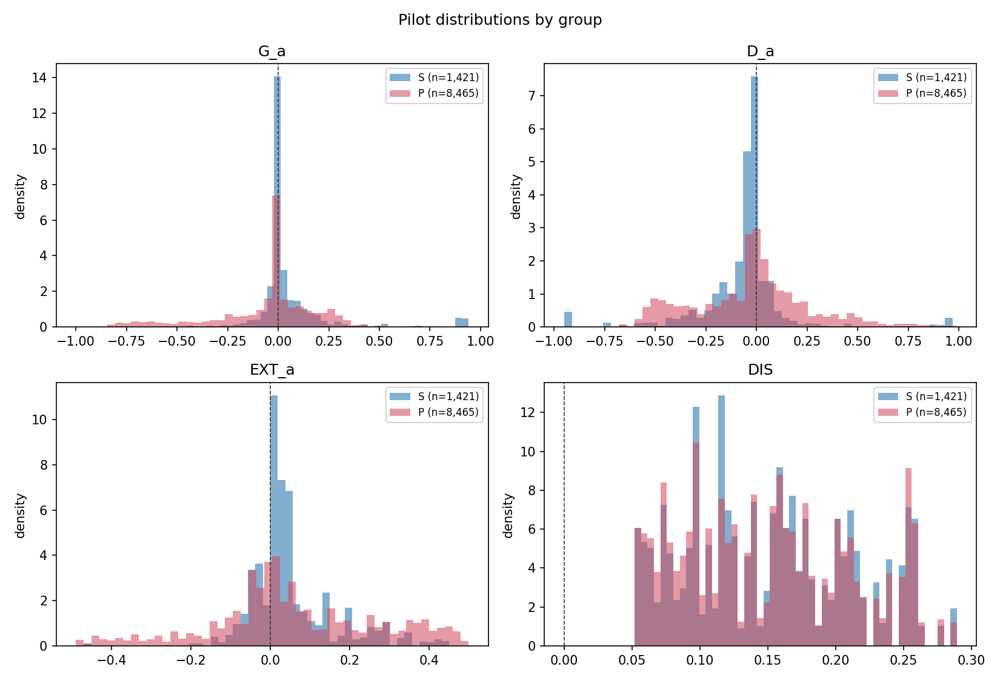
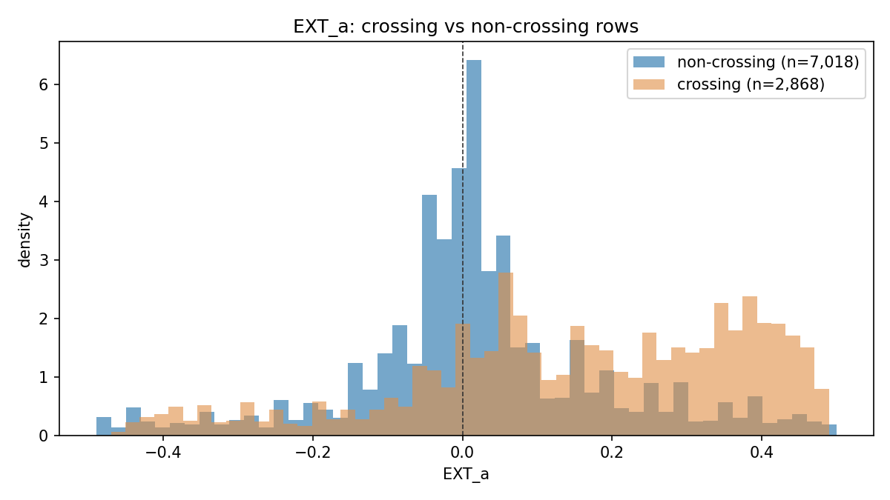

# ForecastBench pilot — SPEC v1 + Amendment 1

Generated 2026-09-07 01:36:23Z · spec commit `f94cb63` · **pilot only, full sample not run**

Pilot scope per Amendment 1 E.1: a random **30% of questions** (seed 20260907), carrying all of their targets. H5 is excluded from the pilot by the same clause. Deliverables §9 items 1–9 and 11 follow, plus the Amendment 1 diagnostics.

## Core quantities at a glance

Factual only; SPEC §9 item 12 (interpretation) belongs to the full run.

| Hypothesis | Quantity | Estimate [95% CI] | Note |
|---|---|---|---|
| H1 | mean `G_a` ×100, superforecasters | 5.92 [0.94, 10.90] | positive = human beat baseline (a) |
| H1 | mean `G_a` ×100, public | -4.81 [-7.96, -1.66] | negative = baseline (a) beat human |
| H2 | encompassing coef, superforecaster median | 3.3115 [1.4359, 5.1871] | CI excludes 0 |
| H2 | encompassing coef, public median | 1.8015 [0.1629, 3.4400] | CI excludes 0 |
| H3 | `DIS_z` on `G_a` (core quantity) | 0.0248 [-0.0235, 0.0731] | CI includes 0 |
| H4 | `EXT_a_z` on `G_a` (core quantity, sign only) | 0.0413 [0.0359, 0.0467] | sign: positive |
| H4 | `EXT_a_z:DIS_z` (the one locked interaction) | 0.0161 [0.0099, 0.0223] | sign: positive |

All three §3 sign tests pass. All four mixed models converged (no §5 / Amendment 1 D.1 fallback was needed). Runtime 66s.

**Three things the designer should look at before authorising the full run:** (a) the §0 out-of-range human forecasts and the drop-vs-clip ruling; (b) 29% of rows cross 0.5, which limits what the H4 `EXT_a` sign can mean; (c) the H2 superforecaster median hits the clip bound on 51 of 171 targets (30%), so the S encompassing coefficient is estimated partly on clipped values.

---

## 0. Unanticipated data defect requiring a designer ruling

**200 human forecast rows carry a `p_h` outside [0, 1]** and were excluded before any quantity was computed. Neither the SPEC nor Amendment 1 anticipates this.

- Affected rows: 200 of 33534 resolved human rows (0.60%), all in group P (200).
- Distinct forecasters affected: 42.
- Value quantiles (min/25/50/75/max): -0.01 / 2.09 / 4.83 / 16.73 / **500,043,205.68**.

The public survey asked for a number between 0 and 100 and ForecastBench divided by 100; these are uncleaned free-text mis-entries (e.g. `1.04` = someone typed 104, and one row is 5.0e8). ForecastBench does not filter them. Left in, they are not probabilities: `BS_h` is unbounded, and mean `G_a` over the full frame comes out at roughly −7.5e12 instead of a number in [−1, 1].

**Rule applied for this pilot (minimal, and reversible):** a forecast that is not a probability is not a forecast — rows with `p_h ∉ [0, 1]` are dropped and counted. The alternative (clip to [0, 1]) is reported as a sensitivity in §11. **This is a data-handling decision the designer should confirm or override.**

---

## 1. Environment and versions

| index | value |
|---|---|
| python | 3.9.6 |
| platform | Darwin 25.6.0 (arm64) |
| numpy | 2.0.2 |
| pandas | 2.3.3 |
| scipy | 1.13.1 |
| statsmodels | 0.14.6 |
| matplotlib | 3.9.4 |
| R / lme4 | not installed — see §5 fit notes |

**Data provenance** (`data/PROVENANCE.md`, no re-download — SPEC 2.1):

| index | value |
|---|---|
| datasets repo commit | 68932db171f5e13349d9bda0dd9f96fcf6e227e2 |
| forecast_sets.tar.gz SHA-256 | 219998293a577c820dfa4fdc34541833bd99fd47b60854c2e0424c1a38490b45 |
| processed_forecast_sets.tar.gz SHA-256 | 7f20d24b16b5cacc0c9f1b4f09245aedb17f789504810402ba2458c6ca3486c7 |
| round | 2024-07-21 |

Pilot question list: `data/derived/pilot_questions.csv` (49 questions). Pilot target list: `data/derived/pilot_targets.csv` (171 targets), SHA-256 of the sorted list `90f5d802e4c75cfe119a12e4ce59bd03…`. Both are gitignored; both are reproducible from seed 20260907 and the rule `n = round(0.30 × n_questions)` with `numpy.random.default_rng(seed).choice` over the sorted question keys.

---

## 2. Data coverage (§9 item 2)

**Full round (all 162 questions), after the §0 exclusion:**

| index | forecasters | rows | targets | questions | cov_min | cov_q1 | cov_med | cov_q3 | cov_max |
|---|---|---|---|---|---|---|---|---|---|
| P | 500.0 | 28537.0 | 578.0 | 162.0 | 22.0 | 51.0 | 58.0 | 64.0 | 84.0 |
| S | 40.0 | 4797.0 | 578.0 | 162.0 | 4.0 | 65.5 | 87.0 | 140.8 | 578.0 |

**Pilot (49 questions, 171 targets, 9,886 rows):**

| index | forecasters | rows | targets | questions | cov_min | cov_q1 | cov_med | cov_q3 | cov_max |
|---|---|---|---|---|---|---|---|---|---|
| P | 499.0 | 8465.0 | 171.0 | 49.0 | 1.0 | 11.0 | 16.0 | 22.0 | 45.0 |
| S | 40.0 | 1421.0 | 171.0 | 49.0 | 1.0 | 17.0 | 28.5 | 44.0 | 171.0 |

Forecasters per pilot target — S: min 4, median 7, max 29; P: min 41, median 49, max 60. (Amendment 1 F.4: the H2 superforecaster median rests on as few as 4 forecasts on some targets.)

**Model coverage.** Matched information condition = freeze values, no supplied news (Amendment 1 B.3): **34 variants** = 17 base models × 2 scaffolds (scratchpad with freeze values, zero shot with freeze values).

- Human targets lacking a baseline-(a) forecast: **0**. All 578 human targets are covered by all 34 matched variants.
- Rows dropped because baseline (a) was imputed on that target (Amendment 1 A.3): **0**.
- Human market rows unmappable to a resolution date (Amendment 1 A.1): **242** — the 4 market questions with no resolution row.
- Human rows dropped as unresolved (SPEC 2.2): **21,596**.

**Amendment 1 F corrections confirmed against the data:** the round has 130 LLM variants across all conditions (139 including 9 non-LLM ForecastBench baselines), of which 34 match the human condition; the analysis frame is 33,334 forecaster × target rows, not 310,000; the data contain 40 distinct superforecaster ids (the paper reports 39).

---

## 3. Baseline (a) (§9 item 3)

Selection set (Amendment 1 B.1 — resolved **single-question** targets in the matched condition, minus every human target): **930 targets** across 241 questions.

**Intersection of selection set and test set: 0** — empty, as SPEC §4 requires.

Top 5 of the 34 matched variants by mean Brier on the selection set (imputed rows excluded from scoring, Amendment 1 A.3):

| model | brier | n_scored | imputed_share | eligible |
|---|---|---|---|---|
| Claude-3-5-Sonnet-20240620 (zero shot with freeze values) | 0.1616 | 930 | 0.0000 | yes |
| Claude-3-5-Sonnet-20240620 (scratchpad with freeze values) | 0.1634 | 930 | 0.0000 | yes |
| GPT-4-Turbo-2024-04-09 (zero shot with freeze values) | 0.1756 | 930 | 0.0000 | yes |
| Claude-3-Opus-20240229 (scratchpad with freeze values) | 0.1773 | 930 | 0.0000 | yes |
| GPT-4-Turbo-2024-04-09 (scratchpad with freeze values) | 0.1776 | 930 | 0.0000 | yes |

**Chosen baseline (a): `Claude-3-5-Sonnet-20240620 (zero shot with freeze values)`**, selection-set Brier 0.1616 (×100 = 16.16). Runner-up `Claude-3-5-Sonnet-20240620 (scratchpad with freeze values)` at 0.1634 (×100 = 16.34); margin 0.17 Brier points ×100. No tie, so the Amendment 1 B.2 tie-break was not invoked.

**Eligibility (Amendment 1 A.3, >5% imputed on the selection set):** 1 of 34 variants ineligible: `Claude-2.1 (scratchpad with freeze values)` (5.1%).

Imputed share of every matched variant (diagnostic requested by Amendment 1 A.3):

| model | imputed_share | n_scored | brier |
|---|---|---|---|
| Claude-2.1 (scratchpad with freeze values) | 0.0505 | 883 | 0.2431 |
| Claude-3-Haiku-20240307 (zero shot with freeze values) | 0.0258 | 906 | 0.2841 |
| Mixtral-8x7B-Instruct-V0.1 (scratchpad with freeze values) | 0.0258 | 906 | 0.2310 |
| Gemini-1.5-Flash (zero shot with freeze values) | 0.0054 | 925 | 0.2136 |
| Gemini-1.5-Pro (zero shot with freeze values) | 0.0043 | 926 | 0.1986 |
| Llama-2-70b-Chat-Hf (zero shot with freeze values) | 0.0011 | 929 | 0.2582 |
| Claude-3-5-Sonnet-20240620 (zero shot with freeze values) | 0.0000 | 930 | 0.1616 |
| Claude-2.1 (zero shot with freeze values) | 0.0000 | 930 | 0.2093 |
| Llama-3-70b-Chat-Hf (zero shot with freeze values) | 0.0000 | 930 | 0.2075 |
| Llama-3-70b-Chat-Hf (scratchpad with freeze values) | 0.0000 | 930 | 0.2077 |
| Gemini-1.5-Flash (scratchpad with freeze values) | 0.0000 | 930 | 0.2091 |
| Llama-3-8b-Chat-Hf (scratchpad with freeze values) | 0.0000 | 930 | 0.2353 |

The other 22 variants sit at exactly 0 imputed; 28 of the 34 have no imputed row on the selection set at all.

**Diagnostic — unrestricted-set champion (Amendment 1 B.1).** On the unrestricted selection set (6,680 targets, 86% combination questions) the winner would be `Gemini-1.5-Pro (scratchpad with freeze values)` (Brier 0.1590). This **differs** from the amended choice `Claude-3-5-Sonnet-20240620 (zero shot with freeze values)`, which is the outcome the amendment was written to avoid.

| model | brier | n_scored | imputed_share |
|---|---|---|---|
| Gemini-1.5-Pro (scratchpad with freeze values) | 0.1590 | 6671 | 0.0013 |
| Claude-3-5-Sonnet-20240620 (scratchpad with freeze values) | 0.1666 | 6676 | 0.0006 |
| GPT-4-Turbo-2024-04-09 (scratchpad with freeze values) | 0.1687 | 6675 | 0.0007 |
| Qwen1.5-110B-Chat (scratchpad with freeze values) | 0.1733 | 6667 | 0.0019 |
| GPT-4o (scratchpad with freeze values) | 0.1788 | 6677 | 0.0004 |

---

## 4. Sign tests (§9 item 4, SPEC §3)

- 20 rows where the human is visibly closer to the outcome → `G_a > 0` on all 20: **PASS**
- 20 rows where the model is visibly closer → `G_a < 0` on all 20: **PASS**
- 10 rows where the human is visibly more extreme → `EXT_a > 0` on all 10: **PASS**

**Human visibly closer (largest margin, 20 rows):**

| row | forecaster | target | o | p_h | p_a | G_a |
|---|---|---|---|---|---|---|
| 1 | SFKcpXzkIR | manifold|PNVVTlruggno0Yw5tjVS|2024-08-05 | 1.0000 | 1.0000 | 0.0300 | 0.9409 |
| 2 | S3bbH6xnAb | polymarket|0xf5875410202b3545491774ab5e712a6e05a0ffe780c52270cc8d70cc95164411|2024-08-10 | 0.0000 | 0.0000 | 0.9500 | 0.9025 |
| 3 | SHMLCbokK1 | polymarket|0xc8081f7c63082b34b1b2497f339c291e00587e8800b48db8096fbe763c2be31c|2024-12-31 | 0.0000 | 0.0000 | 0.7200 | 0.5184 |
| 4 | PqSCtDbxAl | fred|IUDSOIA|2025-01-17 | 0.0000 | 0.0000 | 0.7000 | 0.4900 |
| 5 | PqSCtDbxAl | fred|IUDSOIA|2024-10-19 | 0.0000 | 0.0000 | 0.6500 | 0.4225 |
| 6 | PqSCtDbxAl | fred|IUDSOIA|2025-07-21 | 0.0000 | 0.0000 | 0.6500 | 0.4225 |
| 7 | PMOWCcj9Mb | dbnomics|meteofrance_TEMPERATURE_celsius.07591.D|2024-08-20 | 1.0000 | 1.0000 | 0.4000 | 0.3600 |
| 8 | PqSCtDbxAl | fred|IUDSOIA|2024-08-20 | 0.0000 | 0.0000 | 0.6000 | 0.3600 |
| 9 | PJidqWm1cu | fred|RRPONTTLD|2025-01-17 | 0.0000 | 0.0000 | 0.6000 | 0.3600 |
| 10 | PXLa75NxI2 | yfinance|LULU|2025-07-21 | 0.0000 | 0.0000 | 0.6000 | 0.3600 |
| 11 | PkTc8YMq47 | fred|RRPONTTLD|2025-07-21 | 0.0000 | 0.0300 | 0.6200 | 0.3835 |
| 12 | PxOTMBYBZd | fred|DAAA|2024-10-19 | 0.0000 | 0.0000 | 0.5800 | 0.3364 |
| 13 | PYDPZII5cb | fred|DTB1YR|2025-07-21 | 0.0000 | 0.0000 | 0.5800 | 0.3364 |
| 14 | PYDPZII5cb | fred|REAINTRATREARAT10Y|2025-07-21 | 0.0000 | 0.0000 | 0.5800 | 0.3364 |
| 15 | PJidqWm1cu | fred|RRPONTTLD|2024-10-19 | 0.0000 | 0.0000 | 0.5800 | 0.3364 |
| 16 | PntIcsWpOs | dbnomics|meteofrance_TEMPERATURE_celsius.07481.D|2024-07-28 | 1.0000 | 1.0000 | 0.4500 | 0.3025 |
| 17 | PBjyMPvojK | dbnomics|meteofrance_TEMPERATURE_celsius.07481.D|2024-08-20 | 0.0000 | 0.0000 | 0.5500 | 0.3025 |
| 18 | PQ37wwaZMk | dbnomics|meteofrance_TEMPERATURE_celsius.07591.D|2024-07-28 | 1.0000 | 1.0000 | 0.4500 | 0.3025 |
| 19 | PxOTMBYBZd | fred|DAAA|2024-08-20 | 0.0000 | 0.0000 | 0.5500 | 0.3025 |
| 20 | PPdxiC04cd | fred|DPCREDIT|2025-07-21 | 0.0000 | 0.0000 | 0.5500 | 0.3025 |

**Model visibly closer (largest negative margin, 20 rows):**

| row | forecaster | target | o | p_h | p_a | G_a |
|---|---|---|---|---|---|---|
| 1 | PuR5ZXLYo4 | acled|9d683eff8747219752163f7d11d94ff96bbf3b3386a147b59c4829ddb5dac130|2025-01-17 | 0.0000 | 1.0000 | 0.0100 | -0.9999 |
| 2 | P2cY7Jk18R | acled|9d683eff8747219752163f7d11d94ff96bbf3b3386a147b59c4829ddb5dac130|2025-07-21 | 0.0000 | 1.0000 | 0.0100 | -0.9999 |
| 3 | P6CWceYfcO | metaculus|17432|2025-06-30 | 0.0000 | 1.0000 | 0.0100 | -0.9999 |
| 4 | P9cGBhyR2b | wikipedia|2f9337f5d2cc530629386a651bc047c7b76cb3d2fa3222a2fca72a8a7a20e7b2|2025-01-17 | 0.0000 | 1.0000 | 0.0300 | -0.9991 |
| 5 | PsuHJKpbpe | polymarket|0xd9773233f3dd345b0cf99b4338e9663dee025c76bcdae2d8f11efb4327a3566d|2024-12-31 | 0.0000 | 1.0000 | 0.0400 | -0.9984 |
| 6 | P9cGBhyR2b | wikipedia|2f9337f5d2cc530629386a651bc047c7b76cb3d2fa3222a2fca72a8a7a20e7b2|2025-07-21 | 0.0000 | 1.0000 | 0.0500 | -0.9975 |
| 7 | PMWxJnfq3I | dbnomics|meteofrance_TEMPERATURE_celsius.07481.D|2025-01-17 | 0.0000 | 0.9900 | 0.0500 | -0.9776 |
| 8 | PMPnTkxNWC | polymarket|0xfe495172d67c0bd95c8c62b9a9f9815b6e35d9653e5a1f4f8c1abb051e4f3638|2024-11-05 | 0.0000 | 0.9500 | 0.0100 | -0.9024 |
| 9 | Pd6Ragiw3i | wikipedia|2f9337f5d2cc530629386a651bc047c7b76cb3d2fa3222a2fca72a8a7a20e7b2|2024-07-28 | 0.0000 | 0.9500 | 0.0100 | -0.9024 |
| 10 | PMWxJnfq3I | wikipedia|eda8e5b43e0db651905667586e1e72a7d5679cbb5b3ef4dd6faa6444759e2dee|2025-01-17 | 0.0000 | 0.9700 | 0.0300 | -0.9400 |
| 11 | P2s1t6Uzpa | polymarket|0x0784ce77446e73c456f7ea8216108ce3a2673488aba71afdaadb0939324b4c59|2024-12-31 | 0.0000 | 0.9500 | 0.0200 | -0.9021 |
| 12 | Pms59N5y0T | polymarket|0xea3b3876ef2d1777f4320c79e9fb08cd4dbea4f174403995b8884f34aa5d76c9|2024-12-31 | 0.0000 | 0.9500 | 0.0200 | -0.9021 |
| 13 | PMLZmrHqKp | polymarket|0x81bb9ebd9312790810d3d40ee6545d97a8cbaee3233959b3e2bb4c37604e5e82|2024-11-05 | 0.0000 | 1.0000 | 0.0800 | -0.9936 |
| 14 | PrXujyP6ZE | polymarket|0x60752c2a562d7faff00a82238520a13a9a5a5ee2927afd397d224dc54361afd6|2024-08-08 | 1.0000 | 0.0500 | 0.9500 | -0.9000 |
| 15 | PcR8KykF8V | manifold|QHFQmCmz8HplpN2QQnl2|2026-07-16 | 0.0000 | 1.0000 | 0.1100 | -0.9879 |
| 16 | Pd6Ragiw3i | wikipedia|2f9337f5d2cc530629386a651bc047c7b76cb3d2fa3222a2fca72a8a7a20e7b2|2024-08-20 | 0.0000 | 0.9000 | 0.0100 | -0.8099 |
| 17 | PlDy3mbdtn | wikipedia|9fa89a7d296950fe794a71be32c65e5d50930a8dbe0f9a8c780f27eec1529e60|2025-01-17 | 0.0000 | 0.9000 | 0.0200 | -0.8096 |
| 18 | PAd1JmFEwv | infer|1399|2025-01-11 | 1.0000 | 0.1000 | 0.9700 | -0.8091 |
| 19 | PlDy3mbdtn | wikipedia|9fa89a7d296950fe794a71be32c65e5d50930a8dbe0f9a8c780f27eec1529e60|2025-07-21 | 0.0000 | 0.9000 | 0.0300 | -0.8091 |
| 20 | PFk9UrvR1I | wikipedia|eda8e5b43e0db651905667586e1e72a7d5679cbb5b3ef4dd6faa6444759e2dee|2025-07-21 | 0.0000 | 0.9200 | 0.0500 | -0.8439 |

**Human visibly more extreme (largest `EXT_a`, 10 rows):**

| row | forecaster | target | p_h | p_a | CONF_a | EXT_a |
|---|---|---|---|---|---|---|
| 1 | P54fQcAB7K | dbnomics|meteofrance_TEMPERATURE_celsius.07020.D|2025-07-21 | 0.0000 | 0.5000 | 0.0000 | 0.5000 |
| 2 | P2cY7Jk18R | dbnomics|meteofrance_TEMPERATURE_celsius.07117.D|2025-07-21 | 1.0000 | 0.5000 | 0.0000 | 0.5000 |
| 3 | P6CWceYfcO | dbnomics|meteofrance_TEMPERATURE_celsius.07481.D|2025-07-21 | 1.0000 | 0.5000 | 0.0000 | 0.5000 |
| 4 | P9RtHBFzky | dbnomics|meteofrance_TEMPERATURE_celsius.07591.D|2025-07-21 | 0.0000 | 0.5000 | 0.0000 | 0.5000 |
| 5 | PBjyMPvojK | dbnomics|meteofrance_TEMPERATURE_celsius.78925.D|2025-07-21 | 0.0000 | 0.5000 | 0.0000 | 0.5000 |
| 6 | PAd1JmFEwv | wikipedia|cfecaf75abdfe4be7627c5e61a5d7c88541a74fbf3f030dd0b3b81e3f456e655|2025-07-21 | 0.0000 | 0.5000 | 0.0000 | 0.5000 |
| 7 | P0ljpFQFe6 | dbnomics|meteofrance_TEMPERATURE_celsius.78925.D|2024-07-28 | 0.0000 | 0.5100 | 0.0100 | 0.4900 |
| 8 | P2cY7Jk18R | fred|TMBACBW027SBOG|2024-07-28 | 1.0000 | 0.5100 | 0.0100 | 0.4900 |
| 9 | PwI2FtLKsH | yfinance|KHC|2024-07-28 | 0.0000 | 0.5100 | 0.0100 | 0.4900 |
| 10 | PsuHJKpbpe | yfinance|KMB|2024-07-28 | 1.0000 | 0.5100 | 0.0100 | 0.4900 |

---

## 5. Distributions of `G_a`, `D_a`, `EXT_a`, `DIS` (§9 item 5)

Brier quantities are raw (0–1); multiply by 100 for the units used in the text (SPEC §3).

**`G_a`**

| index | q0 | q5 | q25 | q50 | q75 | q95 | q100 | mean | sd |
|---|---|---|---|---|---|---|---|---|---|
| P | -0.9999 | -0.6500 | -0.1275 | 0.0000 | 0.0864 | 0.3000 | 0.9409 | -0.0481 | 0.2698 |
| S | -0.7191 | -0.0900 | 0.0000 | 0.0024 | 0.0528 | 0.4144 | 0.9409 | 0.0592 | 0.1971 |
| all | -0.9999 | -0.6164 | -0.0891 | 0.0000 | 0.0825 | 0.3000 | 0.9409 | -0.0327 | 0.2633 |

**`D_a`**

| index | q0 | q5 | q25 | q50 | q75 | q95 | q100 | mean | sd |
|---|---|---|---|---|---|---|---|---|---|
| P | -0.9500 | -0.5100 | -0.2000 | -0.0100 | 0.1100 | 0.4800 | 0.9900 | -0.0297 | 0.2920 |
| S | -0.9500 | -0.4300 | -0.1100 | -0.0300 | -0.0100 | 0.1300 | 0.9700 | -0.0664 | 0.2237 |
| all | -0.9500 | -0.5100 | -0.1800 | -0.0200 | 0.0900 | 0.4600 | 0.9900 | -0.0350 | 0.2835 |

**`EXT_a`**

| index | q0 | q5 | q25 | q50 | q75 | q95 | q100 | mean | sd |
|---|---|---|---|---|---|---|---|---|---|
| P | -0.4900 | -0.3200 | -0.0500 | 0.0300 | 0.2000 | 0.4200 | 0.5000 | 0.0596 | 0.2100 |
| S | -0.4700 | -0.0700 | 0.0000 | 0.0200 | 0.0750 | 0.3000 | 0.4700 | 0.0506 | 0.1119 |
| all | -0.4900 | -0.3000 | -0.0400 | 0.0250 | 0.1800 | 0.4100 | 0.5000 | 0.0583 | 0.1989 |

**`DIS`**

| index | q0 | q5 | q25 | q50 | q75 | q95 | q100 | mean | sd |
|---|---|---|---|---|---|---|---|---|---|
| P | 0.0519 | 0.0599 | 0.0961 | 0.1449 | 0.1995 | 0.2550 | 0.2892 | 0.1493 | 0.0618 |
| S | 0.0519 | 0.0609 | 0.0990 | 0.1529 | 0.1999 | 0.2550 | 0.2892 | 0.1521 | 0.0608 |
| all | 0.0519 | 0.0599 | 0.0961 | 0.1509 | 0.1995 | 0.2550 | 0.2892 | 0.1497 | 0.0616 |

**`EXT_a` blind spot (§9 item 5).** Share of pilot rows where `p_h` and `p_a` lie on opposite sides of 0.5: **29.0%** (2,868 of 9,886 rows).

| index | q0 | q5 | q25 | q50 | q75 | q95 | q100 | mean | sd |
|---|---|---|---|---|---|---|---|---|---|
| crossing | -0.4700 | -0.3000 | 0.0200 | 0.1800 | 0.3500 | 0.4500 | 0.4900 | 0.1545 | 0.2241 |
| non-crossing | -0.4900 | -0.3000 | -0.0500 | 0.0100 | 0.0900 | 0.3500 | 0.5000 | 0.0190 | 0.1729 |

At 29.0% the share is **material**, so the H4 reading below states it: a positive `EXT_a` coefficient cannot be read as 'extremizing the model's view pays' without separating rows that cross 0.5.

**Diagnostic — `DIS` definition (Amendment 1 C.1).** `DIS` is the within-scaffold SD across the 17 base models, averaged over the two scaffolds. `DIS_all34` is the SD across all 34 variants (the pre-amendment definition).

| index | q0 | q5 | q25 | q50 | q75 | q95 | q100 | mean | sd |
|---|---|---|---|---|---|---|---|---|---|
| DIS | 0.0519 | 0.0599 | 0.0961 | 0.1509 | 0.1995 | 0.2550 | 0.2892 | 0.1497 | 0.0616 |
| DIS_all34 | 0.0525 | 0.0636 | 0.1031 | 0.1547 | 0.2011 | 0.2628 | 0.3049 | 0.1557 | 0.0640 |

Pearson correlation between the two, at row level: **0.9873**. `DIS_all34` is on average +4.0% larger, which is the scaffold-sensitivity component the amendment removes.

---

## 6. H1 — does the human beat the model on average? (§9 item 6)

Group means of `G_a` × 100, with question-clustered 95% CIs (positive = the human beat baseline (a)):

| index | mean | ci_lo | ci_hi | n | n_questions | n_forecasters |
|---|---|---|---|---|---|---|
| P | -4.813 | -7.963 | -1.662 | 8465.000 | 49.000 | 499.000 |
| S | 5.919 | 0.942 | 10.896 | 1421.000 | 49.000 | 40.000 |

Model `G_a ~ GRP + (1|forecaster) + (1|question) + (1|question:target)` — crossed mixed model, converged=True, 7s — optimiser warnings: The MLE may be on the boundary of the parameter space.

| index | coef | ci_lo | ci_hi |
|---|---|---|---|
| Intercept | -0.03714 | -0.07903 | 0.00475 |
| GRP[T.S] | 0.08511 | 0.05903 | 0.11119 |

Variance components:

| index | variance | share |
|---|---|---|
| forecaster | 0.00470 | 0.06403 |
| question | 0.01709 | 0.23294 |
| target | 0.01015 | 0.13841 |
| residual | 0.04141 | 0.56462 |

---

## 7. H2 — encompassing test (§9 item 7)

Target level, logistic, question-clustered SEs. `o ~ logit(p_a) + [logit(p_h_g) − logit(p_a)]`, groups reported separately (SPEC 5.2 forbids pooling):

| group | coef_human_minus_model | ci_lo | ci_hi | coef_logit_p_a | n_targets | n_clusters |
|---|---|---|---|---|---|---|
| S | 3.3115 | 1.4359 | 5.1871 | 4.8836 | 171 | 49 |
| P | 1.8015 | 0.1629 | 3.4400 | 2.1456 | 171 | 49 |

Clipping to (0.01, 0.99) (SPEC 5.2): baseline (a) values clipped **0**; superforecaster medians clipped **51**; public medians clipped **0** (of 171 targets each).

Superforecaster medians on 9 of 171 pilot targets rest on ≤4 individual forecasts (Amendment 1 F.4); the S coefficient must be read with that.

---

## 8. H3 — where does the return live? (§9 item 8)

`G_a ~ DIS_z + CONF_a_z + logHZ_z + MKT + GRP` + crossed REs — crossed mixed model, converged=True, 7s — optimiser warnings: The MLE may be on the boundary of the parameter space.

| index | coef | ci_lo | ci_hi |
|---|---|---|---|
| Intercept | -0.06083 | -0.11068 | -0.01097 |
| GRP[T.S] | 0.08499 | 0.05892 | 0.11107 |
| DIS_z | 0.02478 | -0.02352 | 0.07308 |
| CONF_a_z | -0.03771 | -0.08377 | 0.00835 |
| logHZ_z | -0.01004 | -0.02799 | 0.00790 |
| MKT | 0.11055 | 0.00166 | 0.21945 |

`HZ` enters as log(days), standardized (Amendment 1 D.2). **`logHZ_z` and `MKT` are partly redundant**: market and dataset horizons come from different distributions, so their coefficients should not be read separately. `CONF_a_z`, `logHZ_z`, `MKT` are controls; sign only (SPEC 5.3).

Diagnostic — same model with the pre-amendment `DIS_all34`:

| index | coef | ci_lo | ci_hi |
|---|---|---|---|
| Intercept | -0.05977 | -0.10963 | -0.00992 |
| GRP[T.S] | 0.08499 | 0.05891 | 0.11107 |
| DIS_all34_z | 0.02320 | -0.02736 | 0.07376 |
| CONF_a_z | -0.03682 | -0.08434 | 0.01070 |
| logHZ_z | -0.00954 | -0.02740 | 0.00832 |
| MKT | 0.10155 | -0.00203 | 0.20513 |

---

## 9. H4 — does the direction of deviation pay? (§9 item 9)

`G_a ~ EXT_a_z + absD_a_z + DIS_z + CONF_a_z + logHZ_z + MKT + GRP + EXT_a_z:DIS_z` + crossed REs (the single locked interaction, SPEC 5.4) — crossed mixed model, converged=True, 5s — optimiser warnings: The MLE may be on the boundary of the parameter space.

| index | coef | ci_lo | ci_hi |
|---|---|---|---|
| Intercept | -0.05000 | -0.11837 | 0.01838 |
| GRP[T.S] | 0.03253 | 0.01341 | 0.05164 |
| EXT_a_z | 0.04129 | 0.03587 | 0.04671 |
| absD_a_z | -0.09313 | -0.09852 | -0.08775 |
| DIS_z | 0.03236 | -0.02514 | 0.08986 |
| CONF_a_z | -0.02686 | -0.07832 | 0.02460 |
| logHZ_z | -0.00713 | -0.02579 | 0.01152 |
| MKT | 0.13204 | -0.00515 | 0.26923 |
| EXT_a_z:DIS_z | 0.01607 | 0.00988 | 0.02226 |

**Reading notes carried by this table (Amendment 1 D.3, §9 item 5):**

- `EXT_a = |p_h − 0.5| − CONF_a` by construction, so the `EXT_a_z` coefficient is the effect of the human's extremity **at fixed model confidence and fixed deviation size**.
- 29.0% of rows cross 0.5, where a positive `EXT_a` is not an extremization of the model's view. The sign above is not a clean test of 'extremizing pays' until those rows are separated.
- SPEC 5.4 pre-registers this as two-sided; only the sign is interpreted.

---

## 11. Robustness (§9 item 11, SPEC §7)

### 7.1 Baseline (b) — median of the 34 matched variants

H1 with `G_b` (×100):

| index | mean | ci_lo | ci_hi | n |
|---|---|---|---|---|
| P | -2.752 | -5.731 | 0.226 | 8465.000 |
| S | 6.170 | 3.478 | 8.863 | 1421.000 |

H3 with baseline (b):

| index | coef | ci_lo | ci_hi |
|---|---|---|---|
| Intercept | -0.03516 | -0.06064 | -0.00969 |
| GRP[T.S] | 0.08453 | 0.05842 | 0.11063 |
| DIS_z | 0.06485 | 0.04079 | 0.08891 |
| CONF_b_z | -0.05898 | -0.08471 | -0.03324 |
| logHZ_z | -0.01616 | -0.03302 | 0.00070 |
| MKT | 0.07221 | 0.00632 | 0.13810 |

H4 with baseline (b):

| index | coef | ci_lo | ci_hi |
|---|---|---|---|
| Intercept | -0.02352 | -0.04943 | 0.00238 |
| GRP[T.S] | 0.04052 | 0.02086 | 0.06018 |
| EXT_b_z | 0.07222 | 0.06619 | 0.07825 |
| absD_b_z | -0.08894 | -0.09465 | -0.08323 |
| DIS_z | 0.05886 | 0.03429 | 0.08343 |
| CONF_b_z | -0.03822 | -0.06469 | -0.01176 |
| logHZ_z | -0.01764 | -0.03450 | -0.00078 |
| MKT | 0.05149 | -0.01551 | 0.11850 |
| EXT_b_z:DIS_z | 0.04153 | 0.03637 | 0.04670 |

### 7.2 Log score in place of Brier

`G_log = log(p_h_o) − log(p_a_o)`, probabilities clipped to (0.01, 0.99). Positive = human better, same orientation as `G_a`.

H3 with log score:

| index | coef | ci_lo | ci_hi |
|---|---|---|---|
| Intercept | -0.21688 | -0.39774 | -0.03603 |
| GRP[T.S] | 0.28226 | 0.19196 | 0.37256 |
| DIS_z | 0.08060 | -0.07919 | 0.24039 |
| CONF_a_z | -0.07334 | -0.21928 | 0.07260 |
| logHZ_z | -0.02569 | -0.07948 | 0.02811 |
| MKT | 0.34873 | -0.02244 | 0.71990 |

H4 with log score:

| index | coef | ci_lo | ci_hi |
|---|---|---|---|
| Intercept | -0.15691 | -0.38717 | 0.07335 |
| GRP[T.S] | 0.10949 | 0.04113 | 0.17784 |
| EXT_a_z | 0.03262 | 0.01410 | 0.05114 |
| absD_a_z | -0.28630 | -0.30465 | -0.26795 |
| DIS_z | 0.10596 | -0.07409 | 0.28600 |
| CONF_a_z | -0.08310 | -0.24035 | 0.07416 |
| logHZ_z | -0.02436 | -0.08000 | 0.03128 |
| MKT | 0.37334 | -0.07400 | 0.82069 |
| EXT_a_z:DIS_z | 0.09667 | 0.07560 | 0.11774 |

### 7.3 Dataset questions only

Dropping market targets leaves 153 targets across 31 questions and 8,683 rows.

`MKT` is dropped from the right-hand side because it is constant here.

H3, dataset questions only:

| index | coef | ci_lo | ci_hi |
|---|---|---|---|
| Intercept | -0.05261 | -0.08079 | -0.02442 |
| GRP[T.S] | 0.07646 | 0.04832 | 0.10460 |
| DIS_z | 0.05986 | 0.01601 | 0.10371 |
| CONF_a_z | -0.06157 | -0.10255 | -0.02059 |
| logHZ_z | -0.01055 | -0.02771 | 0.00662 |

H4, dataset questions only:

| index | coef | ci_lo | ci_hi |
|---|---|---|---|
| Intercept | -0.03860 | -0.06961 | -0.00758 |
| GRP[T.S] | 0.01557 | -0.00580 | 0.03695 |
| EXT_a_z | 0.04398 | 0.03803 | 0.04993 |
| absD_a_z | -0.09424 | -0.10065 | -0.08783 |
| DIS_z | 0.05265 | 0.00535 | 0.09995 |
| CONF_a_z | -0.04545 | -0.08930 | -0.00160 |
| logHZ_z | -0.00506 | -0.02265 | 0.01254 |
| EXT_a_z:DIS_z | 0.01320 | 0.00592 | 0.02049 |

### Sensitivity to the §0 rule (clip instead of drop)

Clipping the 200 out-of-range rows to [0, 1] instead of dropping them (64 extra pilot rows). H1 group means × 100:

| index | mean | ci_lo | ci_hi | n |
|---|---|---|---|---|
| P | -5.095 | -8.216 | -1.975 | 8529.000 |
| S | 5.919 | 0.942 | 10.896 | 1421.000 |

---

## Stop

SPEC §10: the pilot stops here. The full sample has **not** been run. H5 (§9 item 10) is excluded from the pilot by Amendment 1 E.1 and awaits the full run. §9 item 12 (interpretation caveats) belongs to the full run and is not written here.

Total runtime 66s (SPEC §8 tripwire: 1 hour).

