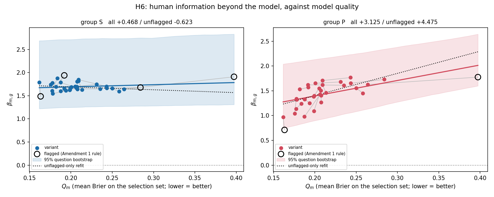
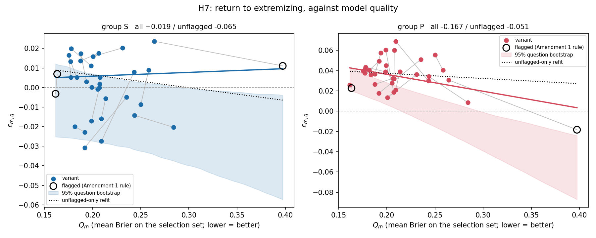

# SPEC v2 full run — benchmark-quality curve, under Amendment 1

Generated 2026-09-08 05:20:48Z · spec `84e54eb` + Amendment 1 · **full sample**

All 34 matched-condition variants as benchmarks, against the v1 analysis frame: 578 resolved targets, 162 questions, 540 forecasters, 33,334 rows. H6, H7, H8 and all five §6 robustness items. §7 items 1–9 follow.

---

## 1. Environment (§7 item 1)

| index | value |
|---|---|
| python | 3.9.6 |
| platform | Darwin 25.6.0 (arm64) |
| numpy | 2.0.2 |
| pandas | 2.3.3 |
| scipy | 1.13.1 |
| statsmodels | 0.14.6 |
| matplotlib | 3.9.4 |
| datasets repo commit | 68932db171f5e13349d9bda0dd9f96fcf6e227e2 |
| bootstrap draws | 2000 |
| bootstrap seed | 20260908 |

Phase timings; SPEC §6 item 4 makes each heavy component individually subject to the one-hour tripwire:

| index | seconds | minutes | over_tripwire |
|---|---|---|---|
| A_stage1 | 3224.4 | 53.7 | no |
| B_validate | 0.6 | 0.0 | no |
| C_boot_beta | 94.2 | 1.6 | no |
| D_boot_eps | 776.8 | 12.9 | no |
| F_boot_eps_log | 776.4 | 12.9 | no |
| E_boot_crossfit | 726.0 | 12.1 | no |

Total wall clock 5606s. **No phase exceeded one hour.**

---

## 2. Per-variant table (§7 item 2)

**[LOCKED] §7 item 4:** every quantity is on that variant's own retained targets. `targets_kept` is the count after dropping targets where that variant's forecast is imputed. **The y values are not computed on identical target sets across the x axis.** No reweighting is applied.

**β and Q:**

| base | scaffold | Q_m | Q_combo | imputed_targets | targets_kept | beta_S | beta_S_lo | beta_S_hi | beta_P | beta_P_lo | beta_P_hi | G_S | G_P |
|---|---|---|---|---|---|---|---|---|---|---|---|---|---|
| Claude-3-5-Sonnet-20240620 | zero shot with freeze values | 0.1616 | 0.1907 | 0 | 578 | 1.7892 | 1.0444 | 2.5341 | 0.9718 | 0.2397 | 1.7040 | 0.0338 | -0.0781 |
| Claude-3-5-Sonnet-20240620 | scratchpad with freeze values | 0.1634 | 0.1672 | 0 | 578 | 1.4868 | 0.8002 | 2.1734 | 0.7108 | 0.0131 | 1.4086 | 0.0223 | -0.0843 |
| GPT-4-Turbo-2024-04-09 | zero shot with freeze values | 0.1756 | 0.2052 | 0 | 578 | 1.7436 | 1.0879 | 2.3993 | 1.0437 | 0.3553 | 1.7321 | 0.0338 | -0.0694 |
| Claude-3-Opus-20240229 | scratchpad with freeze values | 0.1773 | 0.2013 | 0 | 578 | 1.6088 | 0.8901 | 2.3274 | 1.1363 | 0.5060 | 1.7667 | 0.0427 | -0.0630 |
| GPT-4-Turbo-2024-04-09 | scratchpad with freeze values | 0.1776 | 0.1672 | 0 | 578 | 1.7753 | 1.0395 | 2.5112 | 1.3418 | 0.6252 | 2.0584 | 0.0619 | -0.0468 |
| Gemini-1.5-Pro | scratchpad with freeze values | 0.1779 | 0.1560 | 0 | 578 | 1.5452 | 0.8547 | 2.2358 | 1.3208 | 0.6787 | 1.9628 | 0.0434 | -0.0628 |
| Qwen1.5-110B-Chat | scratchpad with freeze values | 0.1818 | 0.1719 | 0 | 578 | 1.6940 | 1.0355 | 2.3524 | 1.5311 | 0.9011 | 2.1612 | 0.0612 | -0.0443 |
| Claude-3-Opus-20240229 | zero shot with freeze values | 0.1836 | 0.1845 | 0 | 578 | 1.8810 | 1.0633 | 2.6988 | 1.2424 | 0.6117 | 1.8732 | 0.0368 | -0.0666 |
| GPT-4o | scratchpad with freeze values | 0.1875 | 0.1774 | 0 | 578 | 1.7874 | 1.0316 | 2.5432 | 0.9792 | 0.2809 | 1.6775 | 0.0437 | -0.0610 |
| GPT-4-0613 | zero shot with freeze values | 0.1877 | 0.2254 | 0 | 578 | 1.6002 | 0.9601 | 2.2403 | 1.3296 | 0.6705 | 1.9887 | 0.0457 | -0.0571 |
| Llama-3-8b-Chat-Hf | zero shot with freeze values | 0.1918 | 0.2193 | 0 | 578 | 1.6513 | 0.9749 | 2.3277 | 1.6204 | 1.0516 | 2.1892 | 0.0714 | -0.0295 |
| Qwen1.5-110B-Chat | zero shot with freeze values | 0.1920 | 0.2277 | 0 | 578 | 1.9408 | 1.3694 | 2.5122 | 1.5698 | 0.9824 | 2.1572 | 0.0641 | -0.0389 |
| GPT-4-0613 | scratchpad with freeze values | 0.1937 | 0.1921 | 1 | 577 | 1.6099 | 0.9035 | 2.3163 | 1.2528 | 0.5782 | 1.9274 | 0.0527 | -0.0540 |
| Gemini-1.5-Pro | zero shot with freeze values | 0.1986 | 0.2185 | 0 | 578 | 1.6253 | 0.9626 | 2.2880 | 1.3829 | 0.7711 | 1.9947 | 0.0567 | -0.0475 |
| Mistral-Large-Latest | scratchpad with freeze values | 0.1989 | 0.2005 | 0 | 578 | 1.6356 | 0.8327 | 2.4386 | 1.0932 | 0.4856 | 1.7009 | 0.0493 | -0.0590 |
| Mixtral-8x22B-Instruct-V0.1 | scratchpad with freeze values | 0.1991 | 0.2099 | 0 | 578 | 1.6701 | 1.0556 | 2.2846 | 1.4009 | 0.7782 | 2.0237 | 0.0620 | -0.0437 |
| Mixtral-8x7B-Instruct-V0.1 | zero shot with freeze values | 0.2006 | 0.2679 | 0 | 578 | 1.6893 | 1.0155 | 2.3631 | 1.6520 | 1.0697 | 2.2342 | 0.0955 | -0.0101 |
| Mixtral-8x22B-Instruct-V0.1 | zero shot with freeze values | 0.2053 | 0.2154 | 0 | 578 | 1.7026 | 1.0619 | 2.3433 | 1.5521 | 0.9222 | 2.1819 | 0.0695 | -0.0361 |
| GPT-4o | zero shot with freeze values | 0.2064 | 0.2236 | 0 | 578 | 1.6743 | 1.0210 | 2.3276 | 1.4290 | 0.8309 | 2.0270 | 0.0642 | -0.0367 |
| Mistral-Large-Latest | zero shot with freeze values | 0.2072 | 0.2076 | 0 | 578 | 1.6941 | 1.0630 | 2.3252 | 1.5064 | 0.8630 | 2.1497 | 0.0530 | -0.0469 |
| Llama-3-70b-Chat-Hf | zero shot with freeze values | 0.2075 | 0.2128 | 0 | 578 | 1.8088 | 1.0968 | 2.5209 | 1.4031 | 0.7664 | 2.0399 | 0.0722 | -0.0324 |
| Llama-3-70b-Chat-Hf | scratchpad with freeze values | 0.2077 | 0.2240 | 0 | 578 | 1.6417 | 0.9898 | 2.2936 | 1.2701 | 0.5777 | 1.9625 | 0.0714 | -0.0344 |
| Gemini-1.5-Flash | scratchpad with freeze values | 0.2091 | 0.1862 | 0 | 578 | 1.8172 | 1.1760 | 2.4584 | 1.6231 | 1.0141 | 2.2322 | 0.0836 | -0.0206 |
| Claude-2.1 | zero shot with freeze values | 0.2093 | 0.2528 | 1 | 577 | 1.8468 | 1.1069 | 2.5867 | 1.7070 | 1.1142 | 2.2998 | 0.0920 | -0.0142 |
| Gemini-1.5-Flash | zero shot with freeze values | 0.2136 | 0.2256 | 0 | 578 | 1.6306 | 0.9513 | 2.3098 | 1.4601 | 0.8672 | 2.0530 | 0.0624 | -0.0413 |
| Mixtral-8x7B-Instruct-V0.1 | scratchpad with freeze values | 0.2310 | 0.2555 | 17 | 561 | 1.7463 | 0.9141 | 2.5785 | 1.6799 | 1.0627 | 2.2972 | 0.0996 | -0.0134 |
| Llama-3-8b-Chat-Hf | scratchpad with freeze values | 0.2353 | 0.2795 | 0 | 578 | 1.6480 | 0.9688 | 2.3273 | 1.6121 | 1.0315 | 2.1927 | 0.1009 | -0.0054 |
| Claude-2.1 | scratchpad with freeze values | 0.2431 | 0.2403 | 33 | 545 | 1.7016 | 0.9595 | 2.4438 | 1.7677 | 1.1449 | 2.3905 | 0.1027 | -0.0051 |
| Claude-3-Haiku-20240307 | scratchpad with freeze values | 0.2435 | 0.2798 | 0 | 578 | 1.6629 | 1.0198 | 2.3059 | 1.6521 | 1.0596 | 2.2445 | 0.1210 | 0.0114 |
| Llama-2-70b-Chat-Hf | scratchpad with freeze values | 0.2501 | 0.2717 | 0 | 578 | 1.6586 | 1.0014 | 2.3158 | 1.5561 | 0.9806 | 2.1315 | 0.1232 | 0.0082 |
| Llama-2-70b-Chat-Hf | zero shot with freeze values | 0.2582 | 0.3224 | 1 | 577 | 1.5916 | 0.9352 | 2.2479 | 1.4496 | 0.9371 | 1.9622 | 0.1209 | 0.0091 |
| GPT-3.5-Turbo-0125 | scratchpad with freeze values | 0.2642 | 0.3080 | 0 | 578 | 1.6407 | 0.9640 | 2.3174 | 1.6266 | 1.0695 | 2.1836 | 0.1381 | 0.0248 |
| Claude-3-Haiku-20240307 | zero shot with freeze values | 0.2841 | 0.2703 | 8 | 570 | 1.6786 | 1.0295 | 2.3277 | 1.7307 | 1.1938 | 2.2676 | 0.1693 | 0.0586 |
| GPT-3.5-Turbo-0125 | zero shot with freeze values | 0.3974 | 0.4304 | 0 | 578 | 1.9104 | 1.2164 | 2.6044 | 1.7765 | 1.2489 | 2.3041 | 0.2804 | 0.1665 |

**ε, with the Amendment 1 item 3 per-variant boundary-warning column:**

| base | scaffold | Q_m | eps_S | eps_S_lo | eps_S_hi | eps_S_warn | eps_P | eps_P_lo | eps_P_hi | eps_P_warn | eps_log_S | eps_log_S_warn | eps_log_P | eps_log_P_warn |
|---|---|---|---|---|---|---|---|---|---|---|---|---|---|---|
| Claude-3-5-Sonnet-20240620 | zero shot with freeze values | 0.1616 | -0.0032 | -0.0077 | 0.0013 | yes | 0.0257 | 0.0221 | 0.0294 | yes | -0.0356 | yes | -0.0494 | no |
| Claude-3-5-Sonnet-20240620 | scratchpad with freeze values | 0.1634 | 0.0069 | 0.0022 | 0.0117 | yes | 0.0228 | 0.0193 | 0.0263 | yes | -0.0012 | yes | -0.0584 | no |
| GPT-4-Turbo-2024-04-09 | zero shot with freeze values | 0.1756 | 0.0165 | 0.0108 | 0.0221 | yes | 0.0396 | 0.0359 | 0.0433 | yes | 0.0267 | yes | 0.0059 | no |
| Claude-3-Opus-20240229 | scratchpad with freeze values | 0.1773 | 0.0133 | 0.0069 | 0.0196 | yes | 0.0378 | 0.0342 | 0.0413 | yes | 0.0155 | yes | 0.0040 | no |
| GPT-4-Turbo-2024-04-09 | scratchpad with freeze values | 0.1776 | 0.0053 | -0.0015 | 0.0120 | yes | 0.0417 | 0.0379 | 0.0455 | yes | -0.0172 | yes | 0.0202 | no |
| Gemini-1.5-Pro | scratchpad with freeze values | 0.1779 | 0.0199 | 0.0132 | 0.0266 | yes | 0.0436 | 0.0399 | 0.0473 | yes | 0.0268 | yes | 0.0201 | no |
| Qwen1.5-110B-Chat | scratchpad with freeze values | 0.1818 | -0.0200 | -0.0284 | -0.0116 | yes | 0.0405 | 0.0363 | 0.0446 | yes | -0.0571 | yes | 0.0132 | no |
| Claude-3-Opus-20240229 | zero shot with freeze values | 0.1836 | 0.0051 | -0.0006 | 0.0109 | yes | 0.0360 | 0.0321 | 0.0399 | yes | -0.0070 | yes | -0.0151 | no |
| GPT-4o | scratchpad with freeze values | 0.1875 | 0.0136 | 0.0080 | 0.0193 | yes | 0.0264 | 0.0228 | 0.0300 | yes | 0.0155 | yes | -0.0345 | no |
| GPT-4-0613 | zero shot with freeze values | 0.1877 | 0.0174 | 0.0109 | 0.0239 | yes | 0.0365 | 0.0327 | 0.0403 | yes | 0.0189 | yes | -0.0047 | no |
| Llama-3-8b-Chat-Hf | zero shot with freeze values | 0.1918 | -0.0308 | -0.0767 | 0.0152 | no | 0.0178 | 0.0130 | 0.0226 | yes | -0.2805 | no | -0.0941 | no |
| Qwen1.5-110B-Chat | zero shot with freeze values | 0.1920 | -0.0228 | -0.0309 | -0.0148 | yes | 0.0494 | 0.0451 | 0.0537 | yes | -0.0779 | yes | 0.0423 | no |
| GPT-4-0613 | scratchpad with freeze values | 0.1937 | 0.0029 | -0.0056 | 0.0115 | yes | 0.0575 | 0.0535 | 0.0615 | yes | -0.0070 | yes | 0.0676 | no |
| Gemini-1.5-Pro | zero shot with freeze values | 0.1986 | 0.0111 | 0.0043 | 0.0178 | yes | 0.0389 | 0.0350 | 0.0429 | yes | 0.0077 | yes | 0.0053 | no |
| Mistral-Large-Latest | scratchpad with freeze values | 0.1989 | -0.0171 | -0.0481 | 0.0140 | no | 0.0605 | 0.0568 | 0.0641 | yes | 0.0587 | yes | 0.0834 | no |
| Mixtral-8x22B-Instruct-V0.1 | scratchpad with freeze values | 0.1991 | 0.0001 | -0.0072 | 0.0075 | yes | 0.0452 | 0.0414 | 0.0490 | yes | -0.0262 | yes | 0.0340 | no |
| Mixtral-8x7B-Instruct-V0.1 | zero shot with freeze values | 0.2006 | 0.0159 | 0.0089 | 0.0229 | yes | 0.0135 | 0.0092 | 0.0179 | yes | 0.0091 | yes | -0.0969 | no |
| Mixtral-8x22B-Instruct-V0.1 | zero shot with freeze values | 0.2053 | -0.0009 | -0.0074 | 0.0055 | yes | 0.0280 | 0.0241 | 0.0319 | yes | -0.0872 | no | -0.0313 | no |
| GPT-4o | zero shot with freeze values | 0.2064 | 0.0175 | 0.0110 | 0.0241 | yes | 0.0325 | 0.0285 | 0.0364 | yes | 0.0202 | yes | -0.0147 | no |
| Mistral-Large-Latest | zero shot with freeze values | 0.2072 | -0.0001 | -0.0065 | 0.0063 | yes | 0.0187 | 0.0151 | 0.0222 | yes | -0.0234 | yes | -0.0576 | no |
| Llama-3-70b-Chat-Hf | zero shot with freeze values | 0.2075 | 0.0018 | -0.0051 | 0.0087 | yes | 0.0322 | 0.0284 | 0.0360 | yes | -0.0097 | yes | -0.0078 | no |
| Llama-3-70b-Chat-Hf | scratchpad with freeze values | 0.2077 | 0.0051 | -0.0032 | 0.0135 | yes | 0.0602 | 0.0562 | 0.0642 | yes | -0.0006 | yes | 0.0882 | no |
| Gemini-1.5-Flash | scratchpad with freeze values | 0.2091 | -0.0160 | -0.0398 | 0.0079 | no | 0.0210 | 0.0170 | 0.0249 | yes | -0.0539 | yes | -0.0489 | no |
| Claude-2.1 | zero shot with freeze values | 0.2093 | -0.0274 | -0.0389 | -0.0159 | yes | 0.0690 | 0.0637 | 0.0742 | yes | -0.0815 | yes | 0.1115 | no |
| Gemini-1.5-Flash | zero shot with freeze values | 0.2136 | -0.0056 | -0.0455 | 0.0344 | no | 0.0390 | 0.0346 | 0.0433 | yes | -0.0634 | yes | -0.0072 | no |
| Mixtral-8x7B-Instruct-V0.1 | scratchpad with freeze values | 0.2310 | 0.0202 | 0.0122 | 0.0283 | yes | 0.0363 | 0.0320 | 0.0406 | yes | 0.0175 | yes | 0.0007 | no |
| Llama-3-8b-Chat-Hf | scratchpad with freeze values | 0.2353 | -0.0050 | -0.0421 | 0.0321 | no | 0.0511 | 0.0464 | 0.0558 | yes | 0.0445 | yes | 0.0674 | no |
| Claude-2.1 | scratchpad with freeze values | 0.2431 | 0.0079 | -0.0031 | 0.0190 | yes | 0.0300 | 0.0250 | 0.0350 | yes | 0.0105 | no | -0.0171 | no |
| Claude-3-Haiku-20240307 | scratchpad with freeze values | 0.2435 | -0.0142 | -0.0240 | -0.0043 | yes | 0.0342 | 0.0296 | 0.0389 | yes | -0.0499 | yes | 0.0125 | no |
| Llama-2-70b-Chat-Hf | scratchpad with freeze values | 0.2501 | -0.0087 | -0.0198 | 0.0023 | yes | 0.0554 | 0.0500 | 0.0609 | yes | -0.0443 | yes | 0.0745 | no |
| Llama-2-70b-Chat-Hf | zero shot with freeze values | 0.2582 | 0.0089 | -0.0005 | 0.0183 | yes | 0.0405 | 0.0361 | 0.0449 | yes | -0.0347 | no | 0.0072 | no |
| GPT-3.5-Turbo-0125 | scratchpad with freeze values | 0.2642 | 0.0236 | 0.0133 | 0.0340 | yes | 0.0308 | 0.0252 | 0.0364 | yes | 0.0259 | yes | 0.0026 | no |
| Claude-3-Haiku-20240307 | zero shot with freeze values | 0.2841 | -0.0204 | -0.0500 | 0.0092 | no | 0.0086 | 0.0037 | 0.0134 | yes | 0.0039 | yes | -0.0724 | no |
| GPT-3.5-Turbo-0125 | zero shot with freeze values | 0.3974 | 0.0111 | 0.0047 | 0.0174 | yes | -0.0183 | -0.0227 | -0.0138 | yes | 0.0008 | yes | -0.1552 | no |

`*_warn` is true where the mixed model raised the optimiser boundary warning: 92 of 136 ε fits. Fits that fell back to clustered OLS: 10.

`G_m,g` is in the β table. **[LOCKED] §3:** it is close to an identity — `G_m,g = BS_m(test) − BS_g(test)`, the second term does not vary with m, and `BS_m(test)` is highly correlated with `Q_m` because both are that variant's Brier on different question sets. It is not plotted.

---

## 3. Figure — β against Q (§7 item 3)

## 4. Figure — ε against Q (§7 item 4)

Scaffold pairs joined in grey; black rings mark points flagged by the Amendment 1 rule; dotted black line is the co-primary unflagged-only refit.

**The ε figure carries the Amendment 1 item 2 statement:** the inner-loop validation failed, so H7 is descriptive and the band shown is not a valid interval for H7 — see §6.

---

## 5. H6 — does human information shrink as the model improves? (§7 item 5)

`β_m,g ~ Q_m`, inverse-variance weighted. Primary interval is the question-level cluster bootstrap (§4 [LOCKED]): 162 questions resampled with replacement, every β recomputed for all 34 variants, stage-2 slope refit, 2000 draws, seed 20260908. `Q_m` held fixed.

**All points:**

| fit | n_variants | slope | boot_lo | boot_hi | draws_used | analytic_lo | analytic_hi |
|---|---|---|---|---|---|---|---|
| S | 34 | 0.4675 | -0.5744 | 1.5038 | 2000 | -0.3411 | 1.2762 |
| P | 34 | 3.1250 | 2.0612 | 4.5415 | 2000 | 1.1888 | 5.0613 |

**Unflagged points only — co-primary (Amendment 1 item 1):**

| fit | n_variants | slope | boot_lo | boot_hi | draws_used | analytic_lo | analytic_hi |
|---|---|---|---|---|---|---|---|
| S | 30 | -0.6231 | -2.4549 | 1.0726 | 2000 | -1.5155 | 0.2692 |
| P | 32 | 4.4753 | 2.7780 | 6.4657 | 2000 | 2.5103 | 6.4404 |

- Group S: slope +0.4675 all points, -0.6231 unflagged (4 flagged). Sign **does NOT survive** — per Amendment 1 item 1 this result is reported as driven by extreme points and **no directional claim is made**.
- Group P: slope +3.1250 all points, +4.4753 unflagged (2 flagged). Sign **survives**.

Amendment 1 leverage thresholds at p=2, n=34: leverage > 0.1176 or Cook's D > 0.1176.

### Descriptive extrapolation — where β reaches zero (§4.1)

| group | Q_min | Q_max | crossing | crossing_lo | crossing_hi | share_outside | within_range |
|---|---|---|---|---|---|---|---|
| S | 0.1616 | 0.3974 | -3.4198 | -33.7446 | 34.2142 | 1.0000 | no |
| P | 0.1616 | 0.3974 | -0.2469 | -0.7781 | -0.0196 | 1.0000 | no |

- Group S: **the fitted line does not reach zero within the observed range of Q** (0.1616–0.3974); not extrapolated beyond it (§4.1). 100.0% of draws put the crossing outside the range.
- Group P: **the fitted line does not reach zero within the observed range of Q** (0.1616–0.3974); not extrapolated beyond it (§4.1). 100.0% of draws put the crossing outside the range.

---

## 6. H7 — does the return to extremizing depend on model quality? (§7 item 6)

### Inner-loop validation (Amendment 1 item 2) — reported before any interval

Amendment 1 replaces the pilot's stage-2 wild cluster bootstrap, which conditioned on the stage-1 ε estimates and was not a valid interval. The replacement inner-loop estimator is OLS with forecaster fixed effects and question-clustered SEs — the estimator SPEC v1 §5 and v1 Amendment 1 D.1 already sanction as the H3/H4 fallback. It is validated against the v1 mixed-model point estimates across all 34 variants:

| quantity | value |
|---|---|
| max |Δ coefficient| | 0.05898 |
| max |Δ SE| | 0.02747 |
| across-variant SD of ε (both groups) | 0.02343 |
| ratio max|Δcoef| / SD(ε) | 2.51758 |

| ('group', '') | ('d_coef', 'max') | ('d_coef', 'mean') | ('d_se', 'max') | ('d_se', 'mean') |
|---|---|---|---|---|
| P | 0.05898 | 0.02365 | 0.01693 | 0.00912 |
| S | 0.05068 | 0.01348 | 0.02747 | 0.00987 |

**Criterion, stated before the verdict:** the discrepancy is material if `max |Δcoef|` is comparable to or larger than the across-variant spread of ε, because that spread is exactly the variation the H7 slope is fitted to. A discrepancy of that size would change the shape of the curve, not just its level.

**Verdict: MATERIAL.** `max |Δcoef|` = 0.05898 against an across-variant SD of ε of 0.02343 — a ratio of 2.52. Per Amendment 1 item 2, **H7 is demoted to descriptive: the slopes below are reported with no interval**, and the H7 figure carries that statement. The bootstrap was run and its output is retained, but it is not reported as an interval for H7.

**All points:**

| fit | n_variants | slope | analytic_lo | analytic_hi |
|---|---|---|---|---|
| S | 34 | 0.0191 | -0.0290 | 0.0673 |
| P | 34 | -0.1668 | -0.3256 | -0.0080 |

**Unflagged points only — co-primary (Amendment 1 item 1):**

| fit | n_variants | slope | analytic_lo | analytic_hi |
|---|---|---|---|---|
| S | 31 | -0.0654 | -0.2614 | 0.1307 |
| P | 32 | -0.0510 | -0.2329 | 0.1309 |

- Group S: slope +0.0191 all points, -0.0654 unflagged (3 flagged). Sign **does NOT survive** — no directional claim is made (Amendment 1 item 1).
- Group P: slope -0.1668 all points, -0.0510 unflagged (2 flagged). Sign **survives**.

---

## 7. H8 — is it the same information across benchmarks? (§7 item 7)

**[LOCKED] §4.3: reported, with no conclusion drawn.**

| quantity | value |
|---|---|
| mean pairwise corr of [logit(p_h_S) − logit(p_m)] | 0.7676 |
| mean pairwise corr of [logit(p_h_P) − logit(p_m)] | 0.3406 |
| reference: mean pairwise corr of logit(p_m) alone | 0.5615 |
| SD of logit(p_h_S) | 2.3964 |
| SD of logit(p_h_P) | 1.2295 |

Computed on the 530 targets where all 34 variants have a non-imputed forecast. The correlation is mechanically inflated because every term shares `logit(p_h_g)`; the reference and the two SDs are reported next to it as §4.3 requires. The two groups straddle the reference in opposite directions, which is what a shared-component artifact looks like. No conclusion is drawn.

---

## 8. Robustness — all five §6 items (§7 item 8)

### 6.1 `Q` measured on combination-question targets

| fit | n_variants | slope | boot_lo | boot_hi | draws_used | analytic_lo | analytic_hi |
|---|---|---|---|---|---|---|---|
| beta S | 34 | 0.3220 | -0.5150 | 1.0640 | 2000.0000 | -0.3949 | 1.0390 |
| beta P | 34 | 2.5062 | 1.5618 | 3.6447 | 2000.0000 | 1.1348 | 3.8776 |
| eps S | 34 | 0.0164 | — | — | — | -0.0303 | 0.0631 |
| eps P | 34 | -0.1079 | — | — | — | -0.2567 | 0.0410 |

`Q_combo` spans 0.1560–0.4304 against 0.1616–0.3974 for the single-question `Q`; rank correlation between them 0.832.

### 6.2 Both Claude-2.1 variants excluded (32 variants)

| fit | n_variants | slope | boot_lo | boot_hi | draws_used | analytic_lo | analytic_hi |
|---|---|---|---|---|---|---|---|
| beta S | 32 | 0.4780 | -0.5998 | 1.5112 | 2000.0000 | -0.3470 | 1.3031 |
| beta P | 32 | 3.0786 | 2.0004 | 4.4956 | 2000.0000 | 1.2930 | 4.8643 |
| eps S | 32 | 0.0203 | — | — | — | -0.0262 | 0.0669 |
| eps P | 32 | -0.1685 | — | — | — | -0.3242 | -0.0128 |

### 6.3 Leverage, and the highest-`Q` variant excluded

Points flagged by the [LOCKED] rule (leverage > 2p/n or Cook's D > 4/n):

| fit | model | Q_m | leverage | cooks_d |
|---|---|---|---|---|
| beta S | Claude-3-5-Sonnet-20240620 (scratchpad with freeze values) | 0.1634 | 0.0678 | 0.1287 |
| beta S | Qwen1.5-110B-Chat (zero shot with freeze values) | 0.1920 | 0.0518 | 0.2456 |
| beta S | Claude-3-Haiku-20240307 (zero shot with freeze values) | 0.2841 | 0.1226 | 0.0233 |
| beta S | GPT-3.5-Turbo-0125 (zero shot with freeze values) | 0.3974 | 0.5571 | 2.0420 |
| beta P | Claude-3-5-Sonnet-20240620 (scratchpad with freeze values) | 0.1634 | 0.0532 | 0.1914 |
| beta P | GPT-3.5-Turbo-0125 (zero shot with freeze values) | 0.3974 | 0.6176 | 4.0895 |
| eps S | Claude-3-5-Sonnet-20240620 (zero shot with freeze values) | 0.1616 | 0.1463 | 0.1521 |
| eps S | Claude-3-5-Sonnet-20240620 (scratchpad with freeze values) | 0.1634 | 0.1252 | 0.0052 |
| eps S | GPT-3.5-Turbo-0125 (zero shot with freeze values) | 0.3974 | 0.7510 | 0.1380 |
| eps P | Claude-3-5-Sonnet-20240620 (scratchpad with freeze values) | 0.1634 | 0.0845 | 0.1241 |
| eps P | GPT-3.5-Turbo-0125 (zero shot with freeze values) | 0.3974 | 0.5813 | 3.1538 |

Refit with the single highest-`Q` variant excluded (distinct from the unflagged refit above, which drops every flagged point):

| fit | n_variants | slope | boot_lo | boot_hi | draws_used | analytic_lo | analytic_hi |
|---|---|---|---|---|---|---|---|
| beta S | 33 | -0.3460 | -1.8904 | 1.1663 | 2000.0000 | -1.2450 | 0.5531 |
| beta P | 33 | 5.1176 | 3.3467 | 7.1970 | 2000.0000 | 2.5838 | 7.6514 |
| eps S | 33 | -0.0020 | — | — | — | -0.1576 | 0.1536 |
| eps P | 33 | -0.0156 | — | — | — | -0.2160 | 0.1848 |

### 6.4 Scale-free y for H6 — cross-fitted out-of-sample log-score gain

`β` is replaced by the out-of-sample improvement in mean log score from adding the human term, cross-fitted in 5 folds by question (seed 20260908), and H6 is rerun with the same question-level bootstrap. Weights are inverse variance, with the SE taken as the question-clustered SE of the mean per-target difference.

| fit | n_variants | slope | boot_lo | boot_hi | draws_used | analytic_lo | analytic_hi |
|---|---|---|---|---|---|---|---|
| S | 34 | 1.09569 | 0.81665 | 1.42227 | 2000 | 0.65813 | 1.53324 |
| P | 34 | 1.01451 | 0.70504 | 1.31932 | 2000 | 0.67606 | 1.35296 |

- Group S: β slope +0.4675, log-score-gain slope +1.09569. Signs **agree** — the H6 conclusion stands on this check (§6 item 4).
- Group P: β slope +3.1250, log-score-gain slope +1.01451. Signs **agree** — the H6 conclusion stands on this check (§6 item 4).

### 6.5 H7 under the log score

| fit | n_variants | slope | analytic_lo | analytic_hi |
|---|---|---|---|---|
| S | 34 | 0.0268 | -0.0918 | 0.1453 |
| P | 34 | -0.3818 | -0.9317 | 0.1682 |

- Group S: Brier ε slope +0.0191, log-score ε slope +0.0268 — signs **agree**.
- Group P: Brier ε slope -0.1668, log-score ε slope -0.3818 — signs **agree**.

---

## 9. What limits the reading (§7 item 9)

**Seventeen independent base models, not 34 points.** The x axis carries 34 points but 17 base models; the two scaffolds of a base model share weights, training data and failure modes and are joined in both figures. Every analytic interval clusters on the base model, and 17 clusters is few — which is why the primary intervals resample questions instead.

**The 34 points share their outcome noise.** Every β and ε rests on the same 578 targets, the same human medians and the same outcomes. Stage-2 clustering cannot see that sharing; the question-level bootstrap can, and it is materially wider as a result.

**All models are mid-2024.** `Q` spans 0.1616–0.3974 within one generation. Nothing here speaks to quality outside that span, which is why §4.1 forbids extrapolating the zero crossing beyond the observed range.

**`Q` is measured on a different question set from the test set.** `Q_m` comes from the selection set (single questions, complement of the human targets); β and ε come from the human targets. That keeps the x axis out of sample, but it makes `Q` a proxy for quality on the test questions rather than a measurement of it.

**The x axis is not evenly covered.** 32 of 34 variants sit between 0.1616 and 0.2642; the top two sit apart at 0.2841 and 0.3974. Any slope is largely a contrast between a dense cluster and a couple of isolated points, which is what the Amendment 1 co-primary refit exists to expose.

---

## Stop

SPEC §10 discipline: delivery stops here. Nothing beyond §7 is inferred.

Total runtime 5606s.

