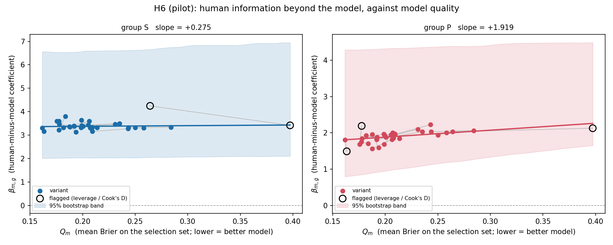
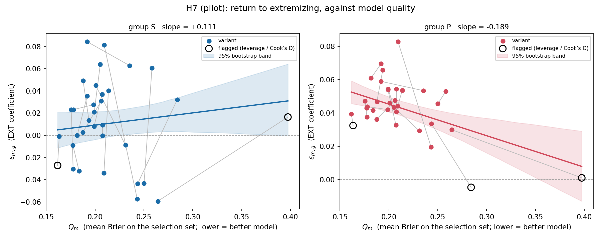

# SPEC v2 pilot — benchmark-quality curve (H6, H7)

Generated 2026-09-08 03:17:25Z · spec commit `84e54eb` · **pilot only, full sample not run**

§5 [LOCKED]: the v1 pilot question subset — 49 of 162 questions, seed 20260907 — carrying all their targets. H6 and H7 only. Deliverables are §7 items 1–6 and 9; items 7 (H8) and 8 (the five §6 robustness items) are not produced by a H6/H7-only pilot and are marked out of scope below. The §6 item-3 leverage statistics are computed because §7 item 4 requires the figures to mark flagged points.

---

## 1. Environment (§7 item 1)

| index | value |
|---|---|
| python | 3.9.6 |
| platform | Darwin 25.6.0 (arm64) |
| numpy | 2.0.2 |
| pandas | 2.3.3 |
| scipy | 1.13.1 |
| statsmodels | 0.14.6 |
| matplotlib | 3.9.4 |
| datasets repo commit | 68932db171f5e13349d9bda0dd9f96fcf6e227e2 |
| bootstrap draws | 2000 |
| bootstrap seed | 20260908 |
| pilot seed | 20260907 |

Runtime: stage 1 (34 variants × 2 groups, β and ε) 154s; H6 question bootstrap 190s; H7 wild cluster bootstrap 0.2s. Total 346s, against the one-hour tripwire.

**Fast-path validation.** The H6 bootstrap recomputes β and its cluster-robust SE inside every draw, which the v1 `models.encompassing` path is too slow to support at the full-run scale. A numpy IRLS with a cluster sandwich is used instead, and it reproduces the v1 path exactly: |Δβ| = 8.88e-16, |ΔSE| = 2.25e-10 on the first variant. Every β reported in the tables below comes from the v1 path, not the fast path.

---

## 2. Per-variant table (§7 item 2)

**[LOCKED] §7 item 4:** every quantity is computed on that variant's own retained targets. `targets_kept` is the pilot-subset count after dropping targets where that variant's forecast is imputed. **The y values are not computed on identical target sets across the x axis.** No reweighting is applied for this.

| base | scaffold | Q_m | imputed_targets | targets_kept | beta_S | beta_S_lo | beta_S_hi | beta_P | beta_P_lo | beta_P_hi | eps_S | eps_S_lo | eps_S_hi | eps_P | eps_P_lo | eps_P_hi | G_S | G_P |
|---|---|---|---|---|---|---|---|---|---|---|---|---|---|---|---|---|---|---|
| Claude-3-5-Sonnet-20240620 | zero shot with freeze values | 0.1616 | 0 | 171 | 3.3115 | 1.4359 | 5.1871 | 1.8015 | 0.1629 | 3.4400 | -0.0271 | -0.0346 | -0.0197 | 0.0395 | 0.0331 | 0.0460 | 0.0592 | -0.0481 |
| Claude-3-5-Sonnet-20240620 | scratchpad with freeze values | 0.1634 | 0 | 171 | 3.1590 | 1.5222 | 4.7958 | 1.4897 | 0.0092 | 2.9701 | -0.0008 | -0.0093 | 0.0078 | 0.0325 | 0.0262 | 0.0389 | 0.0425 | -0.0521 |
| GPT-4-Turbo-2024-04-09 | zero shot with freeze values | 0.1756 | 0 | 171 | 3.5883 | 1.4742 | 5.7024 | 1.6853 | 0.1486 | 3.2219 | 0.0230 | 0.0094 | 0.0367 | 0.0473 | 0.0408 | 0.0537 | 0.0484 | -0.0402 |
| Claude-3-Opus-20240229 | scratchpad with freeze values | 0.1773 | 0 | 171 | 3.2133 | 1.5226 | 4.9039 | 1.7532 | 0.3001 | 3.2063 | -0.0089 | -0.0234 | 0.0056 | 0.0431 | 0.0368 | 0.0495 | 0.0651 | -0.0265 |
| GPT-4-Turbo-2024-04-09 | scratchpad with freeze values | 0.1776 | 0 | 171 | 3.6009 | 2.0498 | 5.1519 | 2.1902 | 0.7104 | 3.6700 | -0.0302 | -0.0422 | -0.0183 | 0.0376 | 0.0311 | 0.0442 | 0.0856 | -0.0072 |
| Gemini-1.5-Pro | scratchpad with freeze values | 0.1779 | 0 | 171 | 3.4609 | 1.6097 | 5.3122 | 1.8414 | 0.4461 | 3.2367 | 0.0232 | -0.0027 | 0.0491 | 0.0439 | 0.0374 | 0.0504 | 0.0619 | -0.0354 |
| Qwen1.5-110B-Chat | scratchpad with freeze values | 0.1818 | 0 | 171 | 3.3178 | 1.5827 | 5.0529 | 1.9283 | 0.5577 | 3.2988 | -0.0000 | -0.0163 | 0.0162 | 0.0611 | 0.0541 | 0.0682 | 0.0658 | -0.0286 |
| Claude-3-Opus-20240229 | zero shot with freeze values | 0.1836 | 0 | 171 | 3.7973 | 1.6682 | 5.9265 | 1.7015 | 0.2798 | 3.1233 | -0.0320 | -0.0544 | -0.0096 | 0.0417 | 0.0350 | 0.0485 | 0.0476 | -0.0424 |
| GPT-4o | scratchpad with freeze values | 0.1875 | 0 | 171 | 3.3664 | 1.4695 | 5.2634 | 1.5664 | -0.2391 | 3.3719 | 0.0026 | -0.0093 | 0.0145 | 0.0363 | 0.0301 | 0.0425 | 0.0652 | -0.0275 |
| GPT-4-0613 | zero shot with freeze values | 0.1877 | 0 | 171 | 3.3541 | 1.5274 | 5.1809 | 1.9532 | 0.5579 | 3.3485 | 0.0494 | 0.0336 | 0.0652 | 0.0469 | 0.0404 | 0.0533 | 0.0562 | -0.0306 |
| Llama-3-8b-Chat-Hf | zero shot with freeze values | 0.1918 | 0 | 171 | 3.3935 | 1.4536 | 5.3333 | 1.8183 | 0.6252 | 3.0113 | 0.0845 | 0.0703 | 0.0986 | 0.0591 | 0.0512 | 0.0669 | 0.0527 | -0.0345 |
| Qwen1.5-110B-Chat | zero shot with freeze values | 0.1920 | 0 | 171 | 3.3743 | 1.6009 | 5.1477 | 1.8774 | 0.5080 | 3.2467 | 0.0356 | 0.0154 | 0.0558 | 0.0696 | 0.0622 | 0.0770 | 0.0646 | -0.0202 |
| GPT-4-0613 | scratchpad with freeze values | 0.1937 | 1 | 170 | 3.1359 | 1.3071 | 4.9647 | 1.5879 | 0.1589 | 3.0170 | 0.0136 | -0.0023 | 0.0296 | 0.0659 | 0.0590 | 0.0728 | 0.0636 | -0.0318 |
| Gemini-1.5-Pro | zero shot with freeze values | 0.1986 | 0 | 171 | 3.3259 | 1.5819 | 5.0699 | 1.9661 | 0.5922 | 3.3399 | 0.0277 | 0.0115 | 0.0438 | 0.0421 | 0.0353 | 0.0490 | 0.0817 | -0.0081 |
| Mistral-Large-Latest | scratchpad with freeze values | 0.1989 | 0 | 171 | 3.6364 | 1.4373 | 5.8355 | 1.6873 | 0.1716 | 3.2030 | 0.0081 | -0.0058 | 0.0221 | 0.0541 | 0.0476 | 0.0605 | 0.0632 | -0.0289 |
| Mixtral-8x22B-Instruct-V0.1 | scratchpad with freeze values | 0.1991 | 0 | 171 | 3.4119 | 1.6591 | 5.1648 | 1.9389 | 0.5811 | 3.2968 | 0.0211 | 0.0049 | 0.0373 | 0.0545 | 0.0480 | 0.0611 | 0.0841 | -0.0130 |
| Mixtral-8x7B-Instruct-V0.1 | zero shot with freeze values | 0.2006 | 0 | 171 | 3.3713 | 1.6174 | 5.1252 | 1.8847 | 0.6550 | 3.1144 | 0.0451 | 0.0322 | 0.0580 | 0.0461 | 0.0388 | 0.0534 | 0.1106 | 0.0229 |
| Mixtral-8x22B-Instruct-V0.1 | zero shot with freeze values | 0.2053 | 0 | 171 | 3.4281 | 1.5425 | 5.3137 | 1.9507 | 0.6153 | 3.2862 | 0.0639 | 0.0499 | 0.0780 | 0.0434 | 0.0368 | 0.0500 | 0.0811 | -0.0084 |
| GPT-4o | zero shot with freeze values | 0.2064 | 0 | 171 | 3.5988 | 1.5007 | 5.6969 | 1.8179 | 0.5015 | 3.1343 | 0.0311 | 0.0182 | 0.0439 | 0.0477 | 0.0409 | 0.0545 | 0.0695 | -0.0178 |
| Mistral-Large-Latest | zero shot with freeze values | 0.2072 | 0 | 171 | 3.3052 | 1.6454 | 4.9651 | 1.9990 | 0.6778 | 3.3202 | 0.0371 | 0.0219 | 0.0523 | 0.0330 | 0.0268 | 0.0391 | 0.0775 | -0.0129 |
| Llama-3-70b-Chat-Hf | zero shot with freeze values | 0.2075 | 0 | 171 | 3.3181 | 1.5768 | 5.0594 | 1.8782 | 0.5263 | 3.2302 | 0.0093 | -0.0061 | 0.0247 | 0.0408 | 0.0344 | 0.0473 | 0.0938 | 0.0045 |
| Llama-3-70b-Chat-Hf | scratchpad with freeze values | 0.2077 | 0 | 171 | 3.3351 | 1.6116 | 5.0585 | 1.8571 | 0.4362 | 3.2781 | -0.0003 | -0.0182 | 0.0176 | 0.0545 | 0.0475 | 0.0615 | 0.0959 | 0.0030 |
| Gemini-1.5-Flash | scratchpad with freeze values | 0.2091 | 0 | 171 | 3.3280 | 1.6010 | 5.0549 | 1.9793 | 0.7431 | 3.2154 | -0.0340 | -0.0464 | -0.0216 | 0.0442 | 0.0375 | 0.0510 | 0.1070 | 0.0097 |
| Claude-2.1 | zero shot with freeze values | 0.2093 | 1 | 170 | 3.1530 | 1.5670 | 4.7391 | 1.9564 | 0.6727 | 3.2401 | 0.0814 | 0.0569 | 0.1059 | 0.0828 | 0.0742 | 0.0914 | 0.0978 | 0.0038 |
| Gemini-1.5-Flash | zero shot with freeze values | 0.2136 | 0 | 171 | 3.3258 | 1.5268 | 5.1248 | 1.8477 | 0.5293 | 3.1660 | 0.0402 | 0.0195 | 0.0608 | 0.0537 | 0.0462 | 0.0612 | 0.0673 | -0.0221 |
| Mixtral-8x7B-Instruct-V0.1 | scratchpad with freeze values | 0.2310 | 6 | 165 | 3.4643 | 1.6174 | 5.3113 | 2.0938 | 0.7417 | 3.4459 | -0.0088 | -0.0224 | 0.0049 | 0.0294 | 0.0217 | 0.0371 | 0.1195 | 0.0212 |
| Llama-3-8b-Chat-Hf | scratchpad with freeze values | 0.2353 | 0 | 171 | 3.4887 | 1.4947 | 5.4827 | 2.0302 | 0.6957 | 3.3647 | 0.0629 | 0.0478 | 0.0781 | 0.0535 | 0.0456 | 0.0613 | 0.1171 | 0.0208 |
| Claude-2.1 | scratchpad with freeze values | 0.2431 | 11 | 160 | 3.2685 | 1.6337 | 4.9034 | 2.2284 | 0.9703 | 3.4865 | -0.0573 | -0.0807 | -0.0338 | 0.0197 | 0.0104 | 0.0291 | 0.1330 | 0.0416 |
| Claude-3-Haiku-20240307 | scratchpad with freeze values | 0.2435 | 0 | 171 | 3.3202 | 1.4459 | 5.1944 | 2.0302 | 0.8122 | 3.2483 | -0.0437 | -0.0648 | -0.0225 | 0.0337 | 0.0251 | 0.0422 | 0.1452 | 0.0486 |
| Llama-2-70b-Chat-Hf | scratchpad with freeze values | 0.2501 | 0 | 171 | 3.3234 | 1.5831 | 5.0637 | 1.9419 | 0.6616 | 3.2222 | -0.0433 | -0.0647 | -0.0219 | 0.0456 | 0.0355 | 0.0557 | 0.1425 | 0.0367 |
| Llama-2-70b-Chat-Hf | zero shot with freeze values | 0.2582 | 0 | 171 | 3.2992 | 1.5235 | 5.0749 | 2.0030 | 0.9259 | 3.0801 | 0.0608 | 0.0392 | 0.0824 | 0.0530 | 0.0452 | 0.0609 | 0.1670 | 0.0676 |
| GPT-3.5-Turbo-0125 | scratchpad with freeze values | 0.2642 | 0 | 171 | 4.2457 | 1.6031 | 6.8882 | 2.0310 | 0.6923 | 3.3697 | -0.0593 | -0.0873 | -0.0314 | 0.0300 | 0.0204 | 0.0397 | 0.1588 | 0.0549 |
| Claude-3-Haiku-20240307 | zero shot with freeze values | 0.2841 | 0 | 171 | 3.3372 | 1.5726 | 5.1018 | 2.0638 | 0.9251 | 3.2025 | 0.0323 | 0.0159 | 0.0487 | -0.0045 | -0.0136 | 0.0045 | 0.2472 | 0.1482 |
| GPT-3.5-Turbo-0125 | zero shot with freeze values | 0.3974 | 0 | 171 | 3.4146 | 1.7212 | 5.1080 | 2.1269 | 1.0317 | 3.2221 | 0.0165 | 0.0041 | 0.0288 | 0.0012 | -0.0064 | 0.0087 | 0.3149 | 0.2112 |

ε fits: 68 mixed models, 3 fell back to question-clustered OLS (SPEC v1 §5 / Amendment 1 D.1). β clipping at (0.01, 0.99): superforecaster medians clipped on 51 of 171 pilot targets, public on 0.

`G_m,g` is reported per §3 and is **close to an identity** — see the figure caption in §3 below.

---

## 3. Figure — β against Q (§7 item 3)

Scaffold pairs of the same base model are joined by a grey line. Points ringed in black are flagged by the §6 item-3 leverage check. Band is the 2.5–97.5 percentile of the H6 question-level cluster bootstrap.

## 4. Figure — ε against Q (§7 item 4)

Same layout. Band is the stage-2 wild cluster bootstrap, which conditions on the stage-1 ε estimates and is therefore narrower than H6's — see §6.

**`G_m,g` caption (§3 [LOCKED]).** `G_m,g` is reported in the §2 table and is not plotted, because it is close to an identity: `G_m,g = BS_m(test) − BS_g(test)`, the second term does not vary with m, and `BS_m(test)` is highly correlated with `Q_m` because both are that variant's Brier on different question sets. Any figure of it must carry this statement.

---

## 5. H6 — does human information shrink as the model improves? (§7 item 5)

Stage 2: `β_m,g ~ Q_m`, inverse-variance weighted. **Primary interval is the question-level cluster bootstrap** (§4 [LOCKED]): the pilot's questions are resampled with replacement (seed 20260908), every β_m is recomputed on the resampled data for all 34 variants, and the stage-2 slope is refit — 2,000 times. `Q_m` is held fixed, as [LOCKED], because it is measured on the selection set, which contains no test targets.

| group | n_variants | n_base_models | slope | boot_lo | boot_hi | analytic_lo | analytic_hi | draws_used |
|---|---|---|---|---|---|---|---|---|
| S | 34 | 17 | 0.2746 | -2.3890 | 3.9885 | -0.6729 | 1.2220 | 2000 |
| P | 34 | 17 | 1.9194 | -0.1592 | 4.4737 | 0.8798 | 2.9590 | 2000 |

The analytic interval clustered by base model is shown for comparison and is **the narrowest and least appropriate** of the two: 17 clusters understate uncertainty, and it cannot see the outcome noise shared across all 34 variants.

Bootstrap draws discarded (too few variants fittable): S 0, P 0 of 2000. Individual variant fits that failed inside a draw (separation or singular cluster matrix): S 14, P 2 of 68000 attempted.

### Descriptive extrapolation — where β reaches zero

**Reported without inference (§4.1).** The crossing is computed inside every bootstrap draw, so the interval comes from the same resampling as the slope.

| group | Q_observed_min | Q_observed_max | crossing_point | crossing_lo | crossing_hi | share_draws_outside_range | within_observed_range |
|---|---|---|---|---|---|---|---|
| S | 0.1616 | 0.3974 | -12.0904 | -45.1155 | 52.2006 | 1.0000 | no |
| P | 0.1616 | 0.3974 | -0.7799 | -13.0012 | 6.9301 | 1.0000 | no |

- Group S: the fitted line **does not reach zero within the observed range of Q** (0.1616–0.3974). Per §4.1 the crossing is not extrapolated beyond the range; the point value above is shown only to locate it.
- Group P: the fitted line **does not reach zero within the observed range of Q** (0.1616–0.3974). Per §4.1 the crossing is not extrapolated beyond the range; the point value above is shown only to locate it.
- Share of bootstrap draws whose crossing lies outside the observed range: S 1.000, P 1.000.

---

## 6. H7 — does the return to extremizing depend on model quality? (§7 item 6)

Stage 2: `ε_m,g ~ Q_m`, inverse-variance weighted. Interval is the stage-2 **wild cluster bootstrap** over the 17 base models (Rademacher weights, 2000 draws, seed 20260908).

| group | n_variants | n_base_models | slope | wild_lo | wild_hi | analytic_lo | analytic_hi | draws_used |
|---|---|---|---|---|---|---|---|---|
| S | 34 | 17 | 0.1107 | -0.0580 | 0.2839 | -0.0977 | 0.3192 | 2000 |
| P | 34 | 17 | -0.1891 | -0.2998 | -0.0760 | -0.3049 | -0.0734 | 2000 |

**[LOCKED] statement required by §4:** this interval **conditions on the stage-1 ε estimates and is therefore narrower than H6's.** Regenerating ε inside each draw would take about 30 days at the full-run scale and is not done. The analytic base-model-clustered interval is shown alongside and is narrower still.

### Leverage and Cook's distance (computed for the §7 item 4 figure marks)

The full §6 item-3 robustness rerun (dropping the highest-`Q` variant) is **not part of the pilot**; only the diagnostics needed to mark the figures are computed here.

**β, group S** — 2 flagged of 34:

| model | Q_m | leverage | cooks_d |
|---|---|---|---|
| GPT-3.5-Turbo-0125 (scratchpad with freeze values) | 0.2642 | 0.0323 | 0.1970 |
| GPT-3.5-Turbo-0125 (zero shot with freeze values) | 0.3974 | 0.6109 | 0.0158 |

**β, group P** — 3 flagged of 34:

| model | Q_m | leverage | cooks_d |
|---|---|---|---|
| Claude-3-5-Sonnet-20240620 (scratchpad with freeze values) | 0.1634 | 0.0556 | 0.1443 |
| GPT-4-Turbo-2024-04-09 (scratchpad with freeze values) | 0.1776 | 0.0415 | 0.1263 |
| GPT-3.5-Turbo-0125 (zero shot with freeze values) | 0.3974 | 0.6397 | 3.5693 |

**ε, group S** — 2 flagged of 34:

| model | Q_m | leverage | cooks_d |
|---|---|---|---|
| Claude-3-5-Sonnet-20240620 (zero shot with freeze values) | 0.1616 | 0.2006 | 0.5226 |
| GPT-3.5-Turbo-0125 (zero shot with freeze values) | 0.3974 | 0.6898 | 0.8953 |

**ε, group P** — 3 flagged of 34:

| model | Q_m | leverage | cooks_d |
|---|---|---|---|
| Claude-3-5-Sonnet-20240620 (scratchpad with freeze values) | 0.1634 | 0.0790 | 0.1326 |
| Claude-3-Haiku-20240307 (zero shot with freeze values) | 0.2841 | 0.0848 | 0.2078 |
| GPT-3.5-Turbo-0125 (zero shot with freeze values) | 0.3974 | 0.6054 | 0.4703 |

---

## 7–8. H8 and the §6 robustness items — out of pilot scope

§5 [LOCKED] runs H6 and H7 only. §7 item 7 (H8 correlations) and §7 item 8 (the five §6 robustness items) are therefore not produced here and are deferred to the full run. H8 is in any case [LOCKED] as report-only with no conclusion drawn, and §3 of the SPEC already records the preliminary values (about 0.77 for superforecasters, 0.34 for the public, against 0.59 for the models alone).

---

## 9. What limits the reading (§7 item 9)

**Seventeen independent base models, not 34 points.** The x axis has 34 points but only 17 independent base models; the two scaffolds of one base model share weights, training data and failure modes, and are joined by a grey line in both figures to make that visible. Every interval here clusters on the base model, and 17 clusters is few.

**The 34 points share their outcome noise.** Every β and ε is estimated on the same 171 pilot targets, the same human medians and the same outcomes. That sharing is why H6's primary interval resamples questions rather than trusting stage-2 clustering, and why H7's interval — which cannot do the same at feasible cost — is explicitly labelled as conditioning on stage 1.

**All models are from mid-2024.** The quality range is a snapshot of one generation (0.1616 to 0.3974 Brier). Nothing here says what happens at quality levels outside that span, which is exactly why §4.1 forbids extrapolating the zero crossing beyond the observed range.

**`Q` is measured on a different question set from the test set.** `Q_m` comes from the selection set (single questions, complement of the human targets); β and ε come from the human targets. This is deliberate — it keeps the x axis out of sample — but it means `Q` is a proxy for the variant's quality *on the test questions*, not a measurement of it.

**Pilot scale.** These estimates rest on 49 questions and 171 targets. Question-level resampling with 49 clusters is itself coarse; the full run has 162 questions and 578 targets.

---

## Stop

SPEC §5: the pilot stops here. The full sample has **not** been run.

Total runtime 346s (tripwire: 1 hour).

